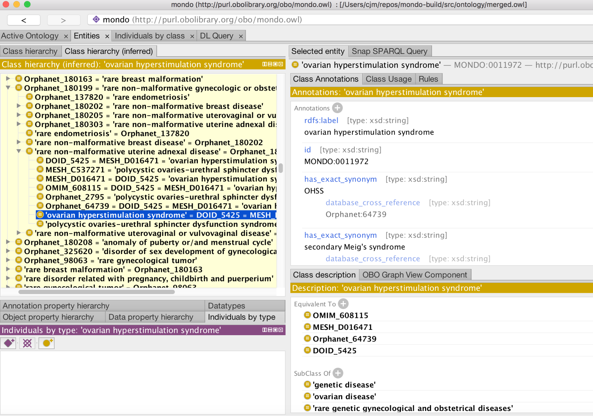

# Build pipeline and Releases

Usual obo workflow applies:

* make test for running tests
* make for building staged release

You can use run.sh to use the ODK Docker container

## Tests

See Makefile for details

* Robot reason - detects logically inconsistency and equivalence between names classes in Mondo
* Sparql checks
    * Standard obo
        * ...
    * Mondo specific
        * ...

## Releases

All release products are described on the OBO page: [http://obofoundry.org/ontology/mondo.html](http://obofoundry.org/ontology/mondo.html) 

* mondo.owl: 
    * Includes owl definitional axioms plus imports
    * Includes owl equivalence axioms to OMIM/Orphanet/DOID/EFO/NCIT/MESH
        * Note: these ontologies are not imported
    * Monarch loads this
* Mondo.obo
    * Excludes owl definitional axioms that reference external ontologies
    * Excludes owl equivalence axioms
    * This is what OLS loads
    * Applications use xrefs

The release mondo.owl will look like this in Protege:

## Release process:

Currently Chris makes releases, but top priority is Dockerizing this so anyone can run it

The size of the OWL file causes some problems with standard GH-based release management. We are currently using OSF.io but this is a pain. We also make GH releases with all main artefacts, we may switch to this mechanism.

