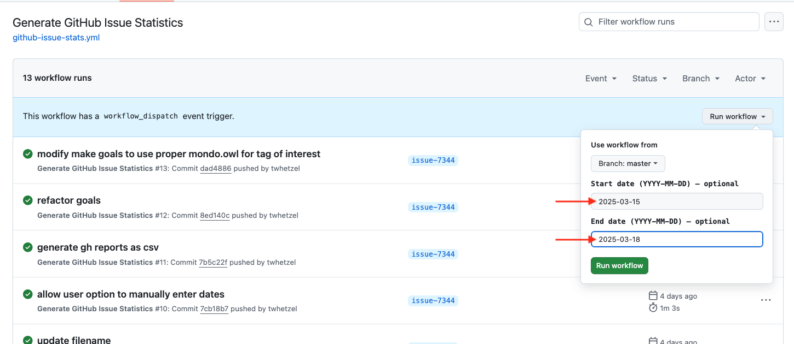
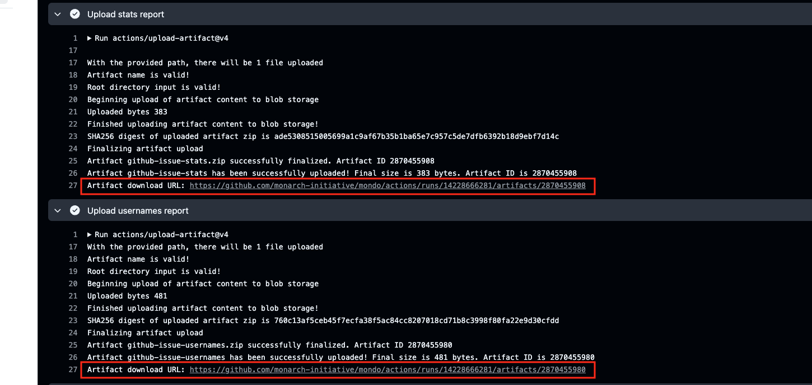

# Create Stats based on Mondo Release Tags

Various statistics can be generated for the Mondo release tag asset `mondo.owl`. This document will describe these statistics and how they can be generated.

## Prerequisites
The statistics are run as `make` goals that run within the Ontology Development Kit (ODK), therefore ODK and Docker are needed similar to running any other `make` goal as part of Mondo development tasks. For example the command to merge a ROBOT template into Mondo (`sh run.sh make merge_template`). 

The Community/GitHub Issue statistics can be run as a GitHub Action or from the commandline. However, if running from the command line Python and knowledge of your GitHub Token is needed (this goal does not run within ODK).

The statistics that are generated from the commandline by default will be run on the most recent tagged release version of Mondo based on date _or_ can be run by adding a specific Mondo tag release date, e.g. v2025-02-04, to generate statistics for Mondo based on the content in the tagged release.

These statistics are currently (2-Apr-2025) being manually saved for each tagged release in the [Mondo Monthly statistics](https://docs.google.com/spreadsheets/d/1TGD1ta2RyoLMvAne1dp-b3LTj6b5Y_jTvsz04HPHmEk/edit?gid=1264043076#gid=1264043076) Google Sheet. 

## General Statistics
The General statistics include the following counts:

- Total number of human diseases
- Total number of non-human diseases
- Total number of human diseases in the rare subset
- Total number of human genetic diseases (human) 
- Total number of infectious diseases (human) 
- Total number of cancer diseases (human) 
- Total number of genetic diseases (non-human)
- Total number of infectious diseases (non-human) 
- Total number of cancer diseases (non-human)  

<h3>Usage:</h3> 
The General statistics can be run on the most recent tagged release as:  
`sh run.sh make create-general-mondo-stats-all`

The General statistics can be run on a specific tagged release as:  
`sh run.sh make MONDO_TAG=v2025-02-04 create-general-mondo-stats-all`

## Rare Subset Statistics
The Rare subset statistics include counts of the following rare subsets:

- rare
- nord rare
- gard rare
- orphanet rare
- inferred rare
- mondo rare

<h3>Usage:</h3> 
The Rare statistics can be run on the most recent tagged release as:  
`sh run.sh make create-rare-mondo-stats-all`

The Rare statistics can be run on a specific tagged release as:  
`sh run.sh make MONDO_TAG=v2025-02-04 create-rare-mondo-stats-all`

## Synonym Statistics
The Synonym statistics include count of the following:

- exact
- narrow
- broad
- related

Within the set of exact synonyms, counts are also generated based on the source(s) for the exact synomym where the sources to count are limited to: OMIM, Orphanet, NCIT, DOID, ICD10CM, icd11.foundation.

<h3>Usage:</h3> 
The Synonym statistics can be run on the most recent tagged release as:  
`sh run.sh make create-synonym-mondo-stats-all`

The Synonym statistics can be run on a specific tagged release as:  
`sh run.sh make MONDO_TAG=v2025-02-04 create-synonym-mondo-stats-all`

## Community/GitHub Issue Statistics
The Community/GitHub Issue statistics include counts of new and closed issues between two calendar dates and the count of all issue labels for each set of new and closed tickets between the two dates. A list of unique GitHub handles for new and closed tickets is also generated along with the count of their unique GitHub labels for the set of these opened and closed tickets.

The dates used to generate these statistics are, by default, the most recent last two Mondo tagged release dates from the date when the statistics are generated. Therefore, if today is 28-Mar-2025, the most recent last two Mondo tagged release dates are 2025-03-04 and 2025-02-04 (see [Mondo tagged releases](https://github.com/monarch-initiative/mondo/tags)). The date parameters can be overriden if needed (see below for details on how to do this). 

NOTE: The GitHub UI shows issues based on your system settings timezone and the data retrieved by the GitHub API used to generate the Community/GitHub Issue statistics is based on UTC timezone ([GitHub Timezones and the REST API](https://docs.github.com/en/rest/using-the-rest-api/timezones-and-the-rest-api?apiVersion=2022-11-28)). Therefore, depending on your system settings, there will be some variability between GitHub issue data filtered in the GitHub UI versus what is returned from the GitHub API and therefore in the Commuity Statistics reports.

<h3>Usage:</h3> 
<h4>From the commandline:</h4>

  1. Export your GitHub token as: 
  `export GITHUB_TOKEN=<YOUR-GITHUB-TOKEN>`
  1. Run the `make` goal as:  
  `make github-issue-stats`  
  NOTE: This is not run with ODK therefore `sh run.sh` is not needed.
  1. Alternatively, to run with custom dates, e.g. from 2025-02-22 to 2025-03-03, use:  
  `make github-issue-stats FROM_DATE=2025-02-22 TO_DATE=2025-03-01`
  
<h4>From the GitHub Action:</h4>

  1. Go to the GitHub Action called [Generate GitHub Issue Statistics](https://github.com/monarch-initiative/mondo/actions/workflows/github-issue-stats.yml)
  1. Click on "Run workflow" and select the branch "master" 
  1. By default, the GitHub Action to generate these statistics will use the dates of the last two most recent Mondo tag release dates since those are generally the time periods of interest. However, custom dates can be used (see screenshot below).
  
  1. Click the green "Run workflow" button
  1. Once complete, scroll to the bottom of the page to find the "Artifacts" section and click on the artifact name to download the ZIP file(s) with the reports.
  

<h4>Examples of GitHub UI filters for Issues:</h4>
  - Filter by created date: `is:issue created:2025-02-04..2025-03-04`
  - Filter by closed date: `is:issue closed:2025-02-04..2025-03-04`
  - Filter by closed date and label: `is:issue closed:2025-02-04..2025-03-04 label:"New term request"`
  
    Tips for searching by dates: [GitHub - Query by dates](https://docs.github.com/en/search-github/getting-started-with-searching-on-github/understanding-the-search-syntax#query-for-dates)  
  
  NOTE: An issue has a "created_at" event and if closed will have a "closed_at" event, which has a date value ([Issue event types - closed](https://docs.github.com/en/rest/using-the-rest-api/issue-event-types?apiVersion=2022-11-28#closed)) and ([REST API endpoints for issue events](https://docs.github.com/en/rest/issues/events?apiVersion=2022-11-28])). There is no event type of "open", however there is an issue "state" of being "open" or "closed". This also means filtering for issues "created" between two dates can contain issues with a state of being "open" or "closed".

## Ontology Change Statistics
_To be added_

## Alignment Statistics
_To be added_

## Third party maintained - xrefs Statistics
_To be added_

## Third party maintained - other Statistics
_To be added_