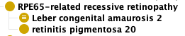
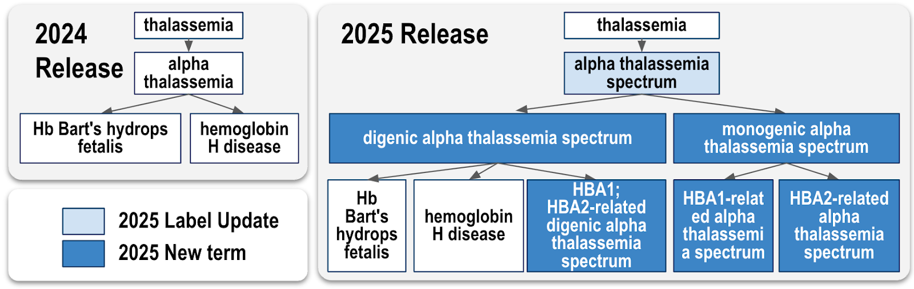

## ClinGen lumping and splitting - rules

by Sabrina Toro     
_updated Feb 13 2025_

**Background:** 
Whether to lump or split disease entities has been recognized as the key challenge of nosology for over five decades [1]. Lumpers group diseases into broader categories that include items that share important features despite some differences; splitters prefer narrower disease categories that subgroup disease entities. 
The Clinical Genome Resource (ClinGen) has developed frameworks to determine whether diseases should be “lumped” or “split”. [2].

In the context of the collaboration between ClinGen and Mondo, many requests refer to “lumping” or “splitting” terms in Mondo. This document summarized the rules followed in Mondo.

**General rules:**
- Mondo aims for 100% alignment with disease terminology sources. For example, all terms in OMIM terms representing a disease should be represented in Mondo. 
- Mondo also does not arbitrate whether disease should be lumped or split, but rather aims to represent all views, allowing for all use cases.

### Term lumping
Lumping diseases refers to the practice of grouping diseases under one main disease.

Example: OMIM considers the following diseases as two separate entities: 
- ‘retinitis pigmentosa 20’ (OMIM:613794; MONDO:0013425)
- ‘leber congenital amaurosis 2’ (OMIM:204100; MONDO:0008765)
However, the [ClinGen Retina Gene Curation Expert Panel](https://clinicalgenome.org/affiliation/40072/) consider these diseases as a single disease entity, and suggested these diseases to be lumped under the name "RPE65-related recessive retinopathy" (https://github.com/monarch-initiative/mondo/issues/4937)

**Mondo rules:**
- create a new term for the "lumped" disease entity
    in the example above:‘RPE65-related recessive retinopathy’ (MONDO:0100368)
- make the disease terms to be lumped SubClass-Of this new "lumped" disease entity. 
    in the example above: ‘retinitis pigmentosa 20’ (MONDO:0013425) and ‘leber congenital amaurosis 2’ (MONDO:0008765) are SubClasses of MONDO:0100368 

### Term splitting
Splitting diseases refers to the practice of dividing a single disease into multiple disease entities.

Example: OMIM has one term for "alpha-thalassemia" (OMIM:604131).
The [ClinGen Hemoglobinopathy Variant Curation Expert Panel](https://www.clinicalgenome.org/affiliation/50052/) suggested that different disease entitites were represented within this single OMIM disease (https://github.com/monarch-initiative/mondo/issues/7561)

**Mondo rules:**
- create a new terms for the new disease entities resulting from the split
- make these new disease terms SubClass-Of the existing Mondo term "to be split". 

Result of the split from the example above:

### Reference
[1] McKusick VA. On lumpers and splitters, or the nosology of genetic disease. Perspect Biol Med. 1969 Winter;12(2):298-312. doi: 10.1353/pbm.1969.0039. PMID: 4304823.
[2] Thaxton C, Goldstein J, DiStefano M, Wallace K, Witmer PD, Haendel MA, Hamosh A, Rehm HL, Berg JS. Lumping versus splitting: How to approach defining a disease to enable accurate genomic curation. Cell Genom. 2022 May 11;2(5):100131. doi: 10.1016/j.xgen.2022.100131. PMID: 35754516; PMCID: PMC9221396.
