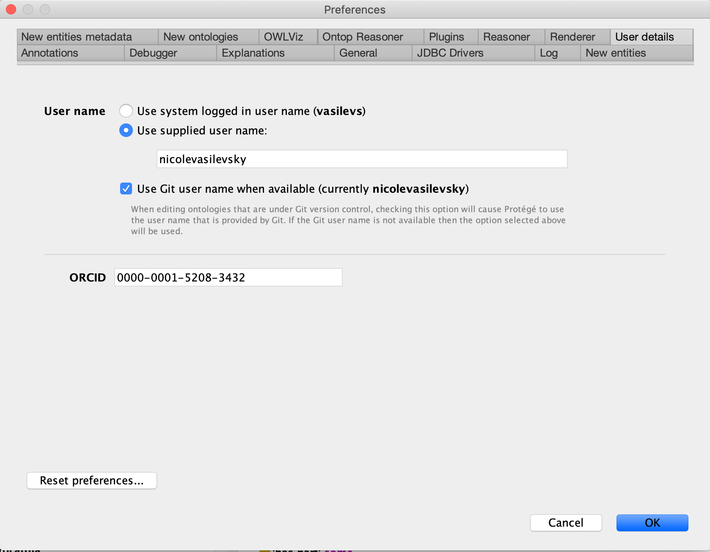

# Protege 5.6 setup for Mondo Editors

(This was adopted from the [Gene Ontology editors guide](http://wiki.geneontology.org/index.php/Protege5_5_setup_for_GO_Eds))

## Operating system
These instructions are for Mac OS.

## Protege version
As of August 2023, Mondo editors are using `Protege version 5.6.

## Download and install Protege
- Get Protege from [protege.stanford.edu](https://protege.stanford.edu/)
- Unzip and move the Protege app to your Applications folder.
- See [Install_Protege5_Mac](https://protegewiki.stanford.edu/wiki/Install_Protege5_Mac) for more instructions and troubleshooting common problems.

### ELK reasoner

The ELK reasoner is included with Protege 5.6. For instructions on adding the ELK reasoner (if you are using an older version of Protege), see the [Install Elk 0.5 in Protege how to guide](https://oboacademy.github.io/obook/howto/installing-elk-in-protege/).

## Increase memory in Protege

Starting from version 5.6, Protege will automatically set the maximal
amount of memory it can use, based on how much memory is available on
your system:

* if you have less than 4G of RAM, Protege will use at most 1G;
* if you have between 4 and 8G, Protege will use at most half of the
  system memory (e.g., 3G if you have 6G);
* if you have between 8 and 16G, Protege will use at most two-thirds of
  the system memory (e.g., 8G if you have 12G);
* if you have more than 16G, Protege will use at most 75% of the system
  memory (e.g., 18G if you have 24G).

This default behaviour means that in most cases, editors shouldn’t have
to worry about manually setting Protege’s max available memory.

Should you wish anyway to set the maximal amount of memory to an
explicit value, you may do so by editing the file
`.Protege/conf/jvm.conf` in your home directory (create that file, and
the parent directory `.Protege/conf` itself, if it does not already
exist) and adding a line like the following:

```
max_heap_size=20G
```

where `20G` is the maxinmal amount of memory you want Protege to use.
Restart Protege (if it was already running) for the new setting to be
taken into account.

When Protege is running, you can check how much memory it is configured
to use by opening the “About Protege” dialog (`Protege > About
Protege`). Look for the line “Max memory set to ...MB”.


## Instructions for new Protege users

### Obtaining your ID range
- Curators and projects are assigned specific Mondo term ID ranges by senior editors.
- These ID ranges are stored in the file: [mondo-idranges.owl](https://github.com/monarch-initiative/mondo/blob/master/src/ontology/mondo-idranges.owl)
- **NOTE:** You should only use IDs within your range.

### Setting ID range
Protégé 5.6 can now automatically set up the ID range for a given user by exploiting the `idranges.owl` file, if it exists. 

This Protege version looks at the ID range file and matches your user name in Protege to the names in the file to automatically set up your ID range. Thus as long as this information matches you no longer need to manually set the ID range. You will get a message if your user name does not match one in the file asking you to pick an ID range.

**Note**: If you are switching from an old Protege version to Protege 5.6, you may need to reset your range to the last used ID rather than just the full range or Protege would try to fill in gaps in the range.

If you are using an older version of Protege, see the [instructions on setting the ID range in OBO Academy](https://oboacademy.github.io/obook/howto/idrange/).)

### Switching ID range

Protege 5.6 manages ID ranges for you automatically and these instructions are not needed.

If you are you using an older version of Protege, see the [instructions here](https://oboacademy.github.io/obook/howto/switching-ontologies/).

## User details

1. `User name` Clcik `Use supplied user name:` add your name (ie nicolevasilevsky)
2. Check `Use Git user name when available`
3. Add `ORCID`. Add the ID number only, do not include https://, ie 0000-0001-5208-3432



## Setting username and auto-adding creation date

1. In the Protege menu, go to `Preferences` > `New Entities Metadata` tab
1. Check `Annotate new entities with creator (user)` box
1. In the `Creator property` field, add `http://purl.org/dc/terms/creator`
1. `Creator value` Select Use ORCID
1. `Date property` http://purl.org/dc/elements/1.1/date
1. `Date value format` Select ISO-8601


