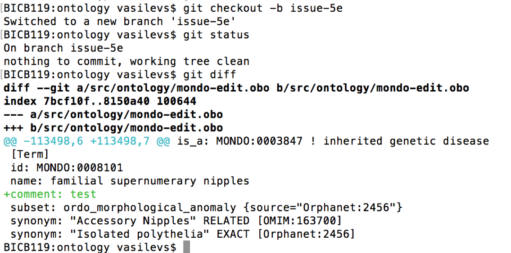
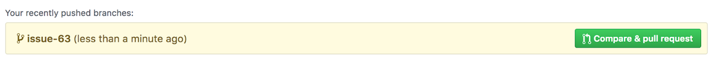

# GitHub Pull Request Workflow

This documentation was adapted from the [Gene Ontology editors guide](http://go-ontology.readthedocs.io/en/latest/DailyWorkflow.html).  
_Updated 2022-07-12 by Nicole Vasilevsky_

## Updating the local copy of the ontology with ‘git pull’
1. In the terminal, navigate to your local directory of mondo: cd git/mondo/src/ontology
2. If the terminal window is not configured to display the branch name, type: git status. You will see:  

`On branch [master] [or the name of the branch you are on]`  
`Your branch is up-to-date with 'origin/master'.`  
  
3. If you’re not in the master branch, type: `git checkout master.`
4. From the master branch, type: `git pull`. This will update your master branch, and all working branches, with the files that are most current on GitHub, bringing in and merging any changes that were made since you last pulled the repository using the command gitpull. You will see something like this:  

`remote: Counting objects: 10, done.`  
`remote: Compressing objects: 100% (4/4), done.`  
`remote: Total 10 (delta 6), reused 10 (delta 6), pack-reused 0`  
`Unpacking objects: 100% (10/10), done.`  
`From https://github.com/monarch-initiative/mondo-build`  
   `013fd6f..477a0e7  master     -> origin/master`  
`Updating 013fd6f..477a0e7`  
`Fast-forward`  
 `src/ontology/mondo-edit.obo | 43 +++++++++++++++++++++++++++++++++++++++----`  
 `1 file changed, 39 insertions(+), 4 deletions(-)`  
`BICB119:ontology vasilevs$ `  

## Creating a New Working Branch with ‘git checkout’
1. When starting to work on a ticket, you should create a new branch of the repository to edit the ontology file.
2. Make sure you are on the master branch before creating a new branch. **Please do not create a new branch off of an existing branch (unless the situation explicitly calls for it).** If the terminal window is not configured to display the branch name, type: `git status` to check which is the active branch. If necessary, go to master by typing `git checkout master`.
3. To create a new branch, type: `git checkout -b issue-NNNNN` in the terminal window. For naming branches, we recommend using the string ‘issue-‘ followed by the issue number. For instance, for this issue in the tracker: [https://github.com/monarch-initiative/mondo/issues/673](https://github.com/monarch-initiative/mondo/issues/673), you would create this branch: `git checkout -b issue-673`. Typing this command will automatically put you in the new branch. You will see this message in your terminal window:
`BICB119:ontology vasilevs$ git checkout -b issue-5
Switched to a new branch 'issue-5'
BICB119:ontology vasilevs$`

## Continuing work on an existing Working Branch
1. If you are continuing to do work on an existing branch, in addition to updating master, go to your branch by typing `git checkout [branch name]`. Note that you can view the existing local branches by typing `git branch -l`.
2. **OPTIONAL:** To update the working branch with respect to the current version of the ontology, type `git pull origin master`. This step is optional because it is not necessary to work on the current version of the ontology; all changes will be synchronized when git merge is performed.

## Editing mondo on a branch
1. Create a new branch, open Protege and navigate to the class as described above. 
2. Make necessary changes in Protege. For example, if there are incorrect xrefs on a class, delete those xrefs.
3.Whenever we editor add dbxrefs, run make norm:
    - navigate to src/ontology in the terminal
    - run the commands:
      `sh run.sh make NORM`
      `mv NORM mondo-edit.obo`
  
## Committing, pushing and making pull requests
1. Review: Changes made to the ontology can be viewed by typing `git diff` in the terminal window. If there are changes that have already been committed, the changes in the active branch relative to master can be viewed by typing `git diff master.`
2. Before committing, run the diff. Examples of a diff are pasted below. Large diffs are a sign that something went wrong. In this case, do not commit the changes and ask Chris Mungall for help instead.

Example 1:

3. Commit: Changes can be committed by typing: `git commit -m ‘Meaningfulmessage Fixes #ticketnumber’ mondo-edit.obo.`
4. For example:
`git commit -m ‘Removed synonym from MONDO_0009591. Addresses #5 mondo-edit.obo.’`
5. This will save the changes to the mondo-edit.obo file. The terminal window will show something like:
`~/repos/go-ontology/src/ontology(issue-13390) $ git commit -m 'Added hepatic stellate cell migration and contraction and regulation terms. Fixes #13390' go-edit.obo`  
 `[issue-13390 dec9df0] Added hepatic stellate cell migration and contraction and regulation terms. Fixes #13390
 1 file changed, 79 insertions(+)`  
` ~/repos/go-ontology/src/ontology(issue-13390) $`  

6. **NOTE**: You can use the word ‘fixes’ or ‘closes’ in the commit message - these are magic words in GitHub; when used in combination with the ticket number, it will automatically close the ticket. In the above example, when the file is merged in GitHub, it will close issue number 673. Learn more on this GitHub Help Documentation page about [Closing issues via commit messages](https://help.github.com/en/articles/closing-issues-using-keywords).
2. ‘Fixes’ and “Closes’ is case-insensitive.
3. If you don’t want to close the ticket, just refer to the ticket # without the word ‘Fixes’ or use ‘Addresses’. The commit will be associated with the correct ticket but the ticket will remain open.
7.**NOTE:** It is also possible to type a longer message than allowed when using the ‘-m’ argument; to do this, skip the -m, and a vi window (on mac) will open in which an unlimited description may be typed.
8. TIP**: Git needs to know who is committing changes to the repository, so the first time you commit, you may see the following message:
`Committer: Kimberly Van Auken <vanauken@kimberlukensmbp.dhcp.lbnl.us>`  
   `Your name and email address were configured automatically based on your username and hostname. Please check that they are accurate.`  
`See Configuration instructions to specify your name and email address.`  

9. **Push**: To incorporate the changes into the remote repository, type: git push originmynewbranch.`  
Example:  
`git push origin issue-673`   

10. **TIP:** Once you have pushed your changes to the repository, they are available for everyone to see, so at this stage you can ask for feedback.

## Make a Pull Request
1. In your browser, return to the [https://github.com/monarch-initiative/mondo](https://github.com/monarch-initiative/mondo) repository on GitHub.
2. Navigate to the tab labeled as ‘Code’ (the [link](https://github.com/monarch-initiative/mondo) above should take you there). You should see your commit listed at the top of the page in a light yellow box. If you don’t see it, click on the ‘Branches’ link to reveal it in the list, and click on it.  

For example:  

3. Click the green button ‘Compare & pull request’ on the right.
4. You may now add comments and ask Chris to review your pull request. Ask Chris to review the ticket before closing it: select a reviewer for the ticket before you make the pull request by clicking on the ‘Reviewers’ list and entering a GitHub identifier (e.g. @cmungall). Chris will be notified when the pull request is submitted. Since the Pull Request is also a GitHub issue, the reviewer’s comments will show up in the dialog tab of the pull request, similarly to any other issue filed on the tracker.
5. The diff for your file is at the bottom of the page. Examine it as a sanity check.
6. Click on the green box ‘Pull request’ to generate a pull request.

## Merging 
1. A member of the Mondo curation team will review and merge any pull requests.
2. Wait for the Travis checks to complete (this usually takes about 30 minutes, unless the checks fail, in which case, you'll see the failure within a few minutes. If the Travis checks failed, go back to your working copy and correct the reported errors.

## Merge instructions
1. If the Travis checks are successful and if you are done working on that branch, merge the pull request. Confirming the merge will close the ticket if you have used the word ‘fixes’ in your commit comment. **NOTE:** Merge the branches only when the work is completed. If there is related work to be done as a follow up to the original request, create a new GitHub ticket and start the process from the beginning.
2. Delete your branch on the repository using the button on the right of the successful merge message.
3. You may also delete the working branch on your local copy. Note that this step is optional. However, if you wish to delete branches on your local machine, in your terminal window:
4. Go back to the master branch by typing `git checkout master`.
5. Update your local copy of the repository by typing `git pull origin master`
6. Delete the branch by typing `git branch -d workingbranchname`.   
Example: `git branch -d issue-13390`
