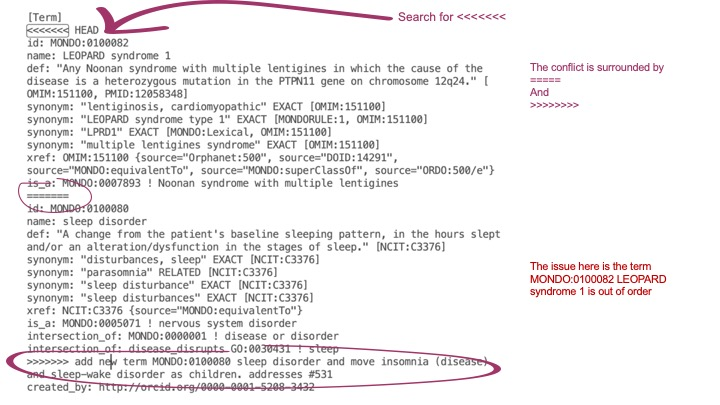
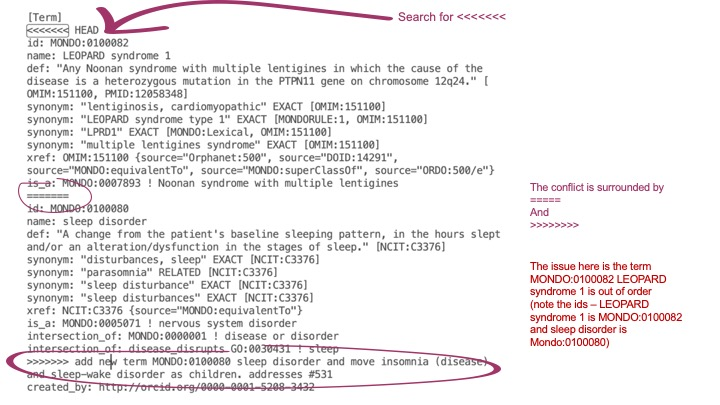
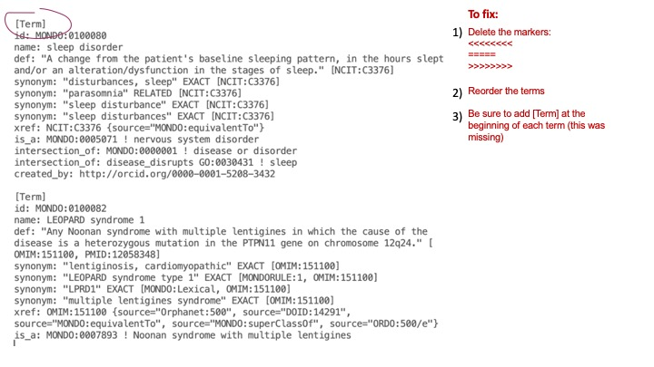
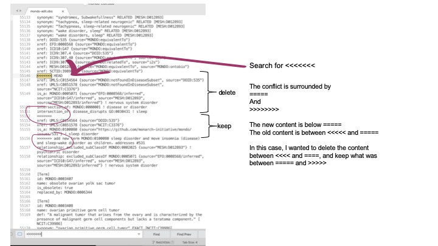

# GitHub conflicts

Sometimes a pull request will have a conflict with the base branch. These conflicts can be resolved by rebasing your branch. See more information about rebasing [here](https://git-scm.com/docs/git-rebase).

### Rebase instructions using command line:
1. checkout branch that has conflicts
2. `git rebase master`
3. Make changes in file (open the mondo-edit.obo file in a text editor (like Sublime) and search for the conflicts. These are usually preceded by <<<<<. Fix the conflicts, then save.)
4. `git add -A`
5. `git rebase --continue`
6. `git push -f`

### Rebase instructions using GitHub Desktop:

_updated 2021-07-12_

1. Master -> fetch pull. 
2. Go to branch with conflict. 
3. Pull branch. 
4. Branch -> update from master. 
5. Open in Sublime or Atom. 
6. Make changes in file (open the mondo-edit.obo file in a text editor (like Sublime) and search for the conflicts. These are usually preceded by <<<<<. Fix the conflicts, then save). 
7. In GitHub Desktop, continue merge. 
8. Push. 
9. In terminal: `open mondo-edit.obo` (or open in Protege manually). 
10. Save as (nothing should have changed in the diff). 
11. Check the diff in GitHub online. 

See additional documentation about what to do in case of a conflict here: [https://github.com/AgileVentures/MetPlus_PETS/wiki/Developing-a-feature-(or-bug,-chore)](https://github.com/AgileVentures/MetPlus_PETS/wiki/Developing-a-feature-(or-bug,-chore)). 

Some examples of conflicts Nicole worked on are below:  

## Video explanation

<iframe width="560" height="315" src="https://www.youtube.com/embed/cB1ZDfBNNN0" title="YouTube video player" frameborder="0" allow="accelerometer; autoplay; clipboard-write; encrypted-media; gyroscope; picture-in-picture" allowfullscreen></iframe>