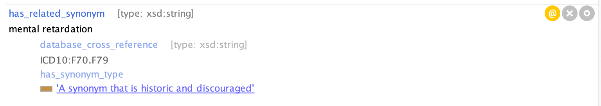
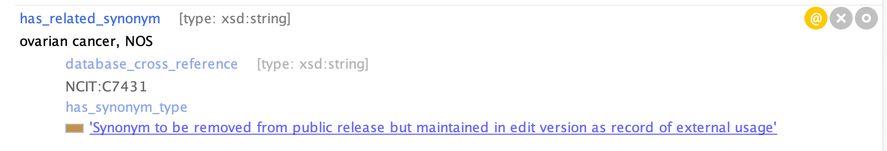
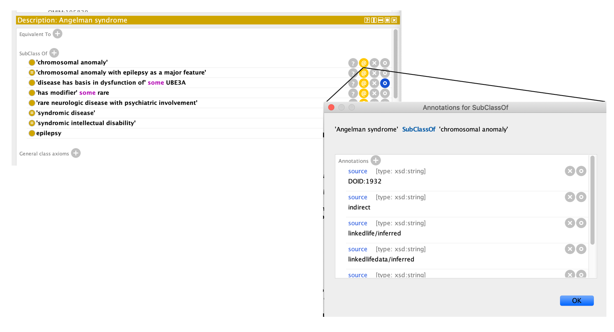

# Entities

## Class IRIs

Standard OBO purl, [see page on how to set up Protege](https://mondo.readthedocs.io/en/latest/editors-guide/protege-setup/).

All classes are in MONDO ID space

## Class Metadata

The standard OBO properties are used:

* Label. **Every class MUST have a single unambiguous label**
* Definition. **Every class SHOULD have a text definition**.
* Synonyms. Use broad/narrow/exact/related wisely.
    * See: [uberon synonyms guide](https://github.com/obophenotype/uberon/wiki/Using-uberon-for-text-mining).
    * TODO: still to clean up a lot of synonym scopes seeded from external ontologies
    * We tend to use BROAD/NARROW generously, even if the sub/super exists. This is because it is useful to annotate other ontologies usages of synonyms.
* Comment: Optional. max one per class (obo-format limit).
    * Use of more specific annotation properties is recommended. These are being hacked into comments at the moment. (e.g Editor note)

## Labels

### Case rules 

- Use lowercase, even for initial letter, except for these exceptions:  
    - proper names (for example, Epstein-Barr virus-associated mesenchymal tumor)  
    - latin names (for example, Homo sapiens)  
    - acronyms (e.g. NADPH, IgG, GM14408, HIV-associated cancer)  
    - Roman numerals (e.g. type II diabetes)  
- Human gene symbols should be capitalized  
- Type symbols should be capitalized (e.g. “type A”)  
- Generally arabic > roman, except for established names (e.g. cranial nerve VII)  

### Uniqueness
  
We strive for uniqueness. **However, be careful when evaluating uniqueness**. Various OMIMs that are apparently distinct have names that are the same, except with different lexicalizations.

### Disease naming 
 
Disease naming conventions are explained [here](https://mondo.monarchinitiative.org/pages/disease-naming/).  

- Mondo follows the OMIM naming conventions. Therefore, the disease name coming from OMIM will be preferentially the primary term label  
- Term relabeling requests (e.g. gene-based labels) are addressed as follow:  
  - if the original term label comes from OMIM, the original label is retained and the requested new label is added as an "exact synonym". If the request comes for a ClinGen working group, the synonym type called ‘ClinGen preferred’ will be added.  
  - if the original term label does not come from OMIM, the term will be relabeled as requested (note that the original label will be added as an exact synonym)  

## Text definitions

We aim to write our own definitions following our standards, but for now we reuse roughly in order:

EFO > {Orphanet,NCIT} > DesignPattern > DOID

NCIT is generally favored over Orphanet, except for genetic non-cancer diseases.

We have overwitten some with our own. We aim for genus-differentia (but not in the style of DO which gets this wrong in many cases, for example, overstating the genus). If you edit a definition and it deviates from the definition dbxref, add your ORCID as an additional dbxref. More details on [how to write simple, concise, and clear operational text definitions is here](https://douroucouli.wordpress.com/2019/07/08/ontotip-write-simple-concise-clear-operational-textual-definitions/).

## Synonyms

Use lowercase, even for initial letter, except for proper names (note: many synonyms remain with leading capitalization, this is improving).

Always annotate synonyms with xrefs. Many of these are currently DOID, Orphanet, GARD, etc IDs. We will add more directly referencing a publication (PMID CURIEs in the format PMID:XXXXXXX). Also add editor ID where appropriate (ORCID, in format with http://, for example: http://orcid.org/0000-0001-5208-3432).

Always indicate synonym scope (see below). Currently the following annotation properties are used:

- hasExactSynonym
- hasBroadSynonym
- hasNarrowSynonym
- hasRelatedSynonym

These are incorrect in many places where they have been brought in externally. **Do not trust scope if there is no synonym xref other than DO**.

### Synonym scope:

#### Exact

The definition of the synonym is exactly the same as primary term definition. This is used when the same class can have more than one name.

For example, MONDO:0003321-hereditary Wilms' tumor : ‘has_exact_synonym’ ‘familial Wilms' tumor’.

#### Narrow

The definition of the synonym is the same as the primary definition, but has additional qualifiers.

For example, MONDO:0004979 asthma : ‘has_narrow_synonym’ ‘exercise-induced asthma’

#### Broad

The primary definition accurately describes the synonym, but the definition of the synonym may encompass other structures as well. In some cases where a broad synonym is given, it will be a broad synonym for more than one ontology term.

For example, MONDO:0016264 autoimmune hepatitis : ‘has_broad_synonym’ ‘autoimmune liver disease’

#### Related

This scope is applied when a word of phrase has been used synonymously with the primary term name in the literature, but the usage is not strictly correct. That is, the synonym in fact has a slightly different meaning than the primary term name. Since users may not be aware that the synonym was being used incorrectly when searching for a term, related synonyms are included.

For example, MONDO:0015263 Brugada syndrome : ‘has_related_synonym’ ‘sudden unexpected nocturnal death syndrome’.

We follow a lot of the same rules as Uberon for text mining: [https://github.com/obophenotype/uberon/wiki/Using-uberon-for-text-mining](https://github.com/obophenotype/uberon/wiki/Using-uberon-for-text-mining)

##### Synonym types

Synonym Label | Synonym type | Description | Example of usage
-- | -- | -- | --
A synonym that is historic and discouraged | DEPRACATE | We mark synonyms with DEPRECATED that are historic and no longer appropriate to use, e.g. all occurrences of “mental retardation” should be “intellectual disability”. We try and avoid including things in this list: [https://en.wikipedia.org/wiki/List_of_medical_eponyms_with_Nazi_associations](https://en.wikipedia.org/wiki/List_of_medical_eponyms_with_Nazi_associations) but if it’s established (e.g. Wegener granulomatosis) may include as a synonym and mark DEPRECATED | MONDO:0001071 'intellectual disability'
A synonym that is recorded for consistency with another source but is a misspelling | MISSPELLING | The source term has a misspelling | MONDO:0011154 acrofacial dysostosis, Palagonia type
abbreviation | ABBREVIATION | Abbreviations of the primary label | MONDO:0004976 'amyotrophic lateral sclerosis'
ambiguous | AMBIGUOUS | A synonym that is unclear or inexact | MONDO:0021636 'astrocytic tumor'
clingen preferred | CLINGEN_PREFERRED | Added to gene-based names/synonyms that were requested by ClinGen, and other terms that are the preferred terms for ClinGen. | MONDO:0700000 'ALG9-associated autosomal dominant polycystic kidney disease'
dubious synonym | DUBIOUS | Not not to be relied upon or suspect | MONDO:0002776 'external ear disease'
Synonym to be removed from public release but maintained in edit version as record of external usage | EXCLUDE | Some synonyms are annotated with EXCLUDE, e.g. “NOS” (not otherwise specified) synonyms. It is useful to have these in the edit version, but these are filtered on release. | MONDO:0011088 congenital myasthenic syndrome 1A, MONDO:0002679 cerebral infarction, MONDO:0008170 'ovarian cancer'

Example of a DEPRECATE synonym in Protege: MONDO_0001071 'intellectual disability'

Example of an EXCLUDE synonym in Protege: MONDO:0008170 'ovarian cancer'

## Axiom Annotations

All axioms (logical and non-logical) **SHOULD** be annotated. We primarily annotate using the oio:source property. Synonyms and definitions are annotated using **database_cross_reference** (from oboInOwl) in the usual way.

The seed version of Mondo was created from external ontologies. We preserve both original axiom annotations where they are provided (e.g. DO) and we also stamp the originating ID.

Thus when we brought in

id: DOID:123
def: “blah” [http://foo.org]

We turn this into

id: MONDO:987
xref: DOID:123 {source=”Mondo:Equivalent”}
def: “blah” [DOID:123, http://foo.org]

If we have two axioms that are identical except different annotations we merge into one with a union of annotations (we use owltools --merge-axiom-annotations)

## Axiom Annotations on Xrefs
We care particularly about xrefs. We have two kinds of annotations on xrefs

* Semantic
* Provenance

We annotate these axioms to provide more specific semantics. Currently equivalence axioms ‘live’ in the xrefs, as it is easier to manage that equivalence axioms. See Protege screenshot below:

Here the xref between MONDO:chondrocalcinosis and Orphanet:1416 as two axiom annotations, one semantic and one provenance/consistency.

* We indicate the source of an xref using source, e.g. the source of the xref from our chondrocalcinosis class to Orphanet:416 is DOID:1156
    * Note: we should consider changing the AP here. It’s not really the case that these are source any more, as they are added after the fact as an easy way to guage consistency of axioms across ontologies.
* We indicate the semantics of the xref using a source of one of
    * MONDO:equivalentTo
    * MONDO:OtherRelationship
    * In the first 3 cases, these are interpreted strongly as an OWL axiom. **Never use equivalentTo for ‘very close to’. Overuse will result in merges**. See also docs on proxy merges
    *  The important one is equivalence, as they others can be inferred.
    * Note: we could of course use OWL axioms directly, but this is awkward for various reasons, so the logical axioms are maintained as annotated xrefs for now.
    * We also use MONDO:obsoleteEquivalent and MONDO:equivalentObsolete for cases where we have exact 1:1 matches between an obsolete and a live class. We want to avoid making an equivalence axiom here.

Note: we used to add annotations to xrefs:
* MONDO:superClassOf
* MONDO:subClassOf
MONDO:superClassOf and MONDO:subClassOf may have been incomplete. These were removed (see ticket [#4688](https://github.com/monarch-initiative/mondo/issues/4688) and they should be inferred with the boomer pipeline.

## Axiom Annotations on Logical Axioms

We aim to always state a reason why a subClassOf axiom exists. We currently use “oio:source” for everything (easier for roundtrip reasons). Currently subClassOf axioms may be annotated with

* List of IDs/CURIEs that support the axiom
* MONDO:Redundant, if it is entailed by other axioms
* ORCID of ontology editor
* PMIDs
* GitHub URLs
* MONDO:XXXXXXX-obsolete (see note below)

For example, see MONDO_0007113 'Angelman syndrome'

_Note_: Some source annotations will be in the format `MONDO:0020484-obsoleted`. The source annotation for a subclasssOf axiom may have an MONDO ID followed by -obsoleted. This means this Mondo term was obsoleted via an obsoletion script, and the term was reclassified under the grandparent. This was done for Orphanet grouping terms, for example MONDO_0016326 'lysosomal disease with hypertrophic cardiomyopathy' is classified as a child of 'heart disease' and the source is MONDO:0020484-obsoleted. MONDO:0020484 is obsoleted now an obsolete class, that was a child of 'heart disease'.

## Axiom Annotations Summary Table

Annotation  |   Description |   What kind of axiom it can apply to  |   Editors only?   |   Example
--- | --- | --- | --- | ---
MONDO:ambiguous     |   Used to indicate where there is a known case where this synonym is ambiguous with something else.   |   synonyms    |   N   |   MONDO:0009825 '5-oxoprolinase deficiency (disease)' (synonym: 5-oxoprolinase deficiency)
MONDO:design_pattern    |   If annotated on a synonym, the synonym was derived from a design pattern.   |   synonyms    |   N   |   MONDO:0009770 '3MC syndrome 1' (synonym: 3MC syndrome caused by mutation in MASP1)
MONDO:directSiblingOf   |   The term that is xref'd is a direct sibling of term. The goal was to capture where someone made an xref.    |   xrefs   |   N   |   MONDO:0008854 ‘Bardet-Biedl syndrome 1’ database_cross_reference: UMLS:C1859564 (refers to ‘Bardet-Biedl syndrome 3’) {source=MONDO:directSiblingOf}
MONDO:entailed  |   An inferred superclass (which is a redundant axiom) |   subclassOf  |   Y   |   MONDO:0001594 'Achilles bursitis'
MONDO:equivalentObsolete    |   Used for cases where we have exact 1:1 matches between a live class in Mondo and an obsolete class in the source ontology. We want to avoid making an equivalence axiom (MONDO:equivalentTo) here.   |   xrefs   |   N   |   MONDO:0020499 'Nipah virus disease' database_cross_reference: Orphanet:1239 (was obsoleted in orphanet) {source=MONDO:equivalentObsolete}
MONDO:equivalentTo  |   This is interpreted strongly as an OWL equivalence axiom, meaning the two terms are considered to be exactly the same. This can be added to any xref where this is true.   |   xrefs   |   N   |   MONDO:0100087 'familial Alzheimer disease' database_cross_reference: GARD:0000632 (refers to the disease in GARD) {source=MONDO:equivalentTo}
MONDO:includedEntryInOMIM | This indicates a term is an 'included' entry in OMIM, for example https://omim.org/entry/233910 | xrefs | N | MONDO:0100167 'dystonia, dopa-responsive, with or without hyperphenylalaninemia, autosomal recessive'
MONDO:kboom-pr-[number]     |   These are the probability scores from the kBoom algorithm.  |  xrefs   |   Y   |   MONDO:0008966 'Aagenaes syndrome'
MONDO:Lexical   |   Same as design_pattern. Should be replaced with specific design_pattern.    |   synonyms    |   N   |   MONDO:0010278 'Christianson syndrome'
MONDO:LexicalVariant    |   Similar to design_pattern, should be replaced with specific documentation about variant documentation.  |  synonyms   |   N   |   MONDO:0006018 'Wissler syndrome'
MONDO:mim2gene_medgen | This indicates the gene relationship came from MedGen. | xrefs |N  | MONDO:0100288 enhanced S-cone syndrome
MONDO:mondoIsNarrowerThanSource   |   The Mondo class is narrower (more specific) than the source xref.   | xrefs   |   N   |   MONDO:0035649 ''adult-onset Steinert myotonic dystrophy'' database_cross_reference: ICD10:G71.1 {source=MONDO:mondoIsNarrowerThanSource}
MONDO:mondoIsBroaderThanSource |   The Mondo class is broader (more general) than the source xref.  |  xrefs  |   N   |   
MONDO:NCBI_mim2gene_medline | This indicates the gene relationship came from MedGen.  | xrefs | N | MONDO:0100288 enhanced S-cone syndrome
MONDO:notFoundInDiseaseSubset   |   This annotation is typically added to dbxefs from UMLS or NCIt, to indicate the term is not from the disease branch.    |   dbxef   |   N   |   MONDO_0015350 '17q11.2 microduplication syndrome'
MONDO:notVerified   | Indicates that the relationship has not been manually verified by a curator and by default is from the automatic subclass sync process. | subclassOf  |   |
MONDO:obsoleteEquivalent    |   Used for cases where we have exact 1:1 matches between an obsolete in Mondo and a live class in the source ontology. We want to avoid making an equivalence axiom (MONDO:equivalentTo) here.    |  xrefs  |   N   |   MONDO:0011812 ‘Duane-radial ray syndrome’ database_cross_reference: Orphanet:959 (was equivalent to MONDO:0019863 which was obsoleted)  {source=MONDO:obsoleteEquivalent}
MONDO:obsoleteEquivalentObsolete    |   Used for cases where we have exact 1:1 matches between an obsolete in Mondo and an obsolete class in the source ontology. We want to avoid making an equivalence axiom (MONDO:equivalentTo) here.    |  xrefs  |   N   |   TBD
MONDO:ontobio   |   Lexical matching method |   subclassOf  |   N   |   MONDO:0012176 'Emanuel syndrome'
MONDO:patterns....  |   A pattern was used to define the term or synonym, see: https://github.com/monarch-initiative/mondo/tree/master/src/patterns |   definitions, synonyms   |   N   |   MONDO:0016593 'acquired ataxia'
MONDO:preferredExternal | Identifies the preferred term in case multiple terms from the same source are merged (aka proxy merge). | database_cross_reference | Y | MONDO:0009666 'holocarboxylase synthetase deficiency' database_cross_reference: SCTID:360369003
MONDO:Redundant |   An inferred superclass (which is a redundant axiom) |   subclassOf  |   N   |   MONDO:0023543 'Katsantoni-Papadakou-Lagoyanni syndrome'
MONDO:relatedTo     |   Used when a term is not equivalent but similar. |   xrefs   |   N   |   MONDO:0015350 '17q11.2 microduplication syndrome'
MONDO:typo | An xref from an external source is a typo. | xrefs | N | MONDO:0019572 autosomal recessive cutis laxa type 1

## Subsets

We use ORDO subClassOf as subset, thus we have subsets starting ordo_ for all their disease metaclassifications: group_of_disorders, etiological_subtype etc. We retain provenance as an axiom annotation.

We add our own subsets. These should be described in the header. They include subsets of classes that need further examination.

We use the n_of_one subset if a disease is described only in one individual or family. We try and retain these unless it is something truly lost in the midsts of time.

## Term tracker item

If you make changes to a Mondo term based on requests on a GitHub ticket, please add an annotation to the URL of the GitHub ticket using the annotation property 'term tracker item' (type xsd:anyURI)

## Susceptibility terms

Susceptibility to diseases should be classified under MONDO:0042489 'disease susceptibility' (or MONDO:0020573 'inherited disease susceptibility', as appropriate). We should group any OMIM susceptibility terms under a susceptibility to disease term. We will not add OMIM xrefs to these, even if the term is part of the OMIMPS. For example, https://www.omim.org/phenotypicSeries/PS161400 - we will create a new class called narcolepsy, susceptibility but will NOT refer back to the OMIMPS. (See related ticket: [https://github.com/monarch-initiative/mondo/issues/5511](https://github.com/monarch-initiative/mondo/issues/5511)).
