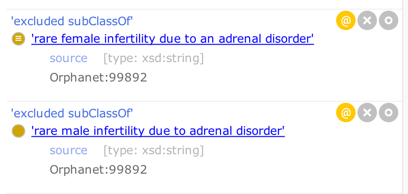

# Logical Axioms

**Always have the reasoner on in Protege!!! Use the inferred view!**

Use Elk, we generally stay within the EL++ subset. Sometimes UnionOf is used but this is not relied upon in inference.

Note if you don’t stay in the inferred view you will see a lot of redundant subclass assertions.

## SubClassOf axioms

For normal ontology development we would avoid asserting axioms that can be inferred. Here we violate this dictum and assert a subClassOf axiom if it is true and it is asserted elsewhere (we annotate axiom with the source ID). 

Some classes in Mondo describe combinations of multiple classes and use "disjunctive" logic ("or") or "conjunctive" logic ("and"), for example 'neonatal inflammatory skin and bowel disease' (MONDO:0017411). For a detailed description of this see [OBO Academy explanation of HOW TO INTERPRET AN 'AND' OR AN 'OR'](https://oboacademy.github.io/obook/explanation/intro-to-ontologies/#how-to-interpret-an-and-or-an-or). 

If we want to remove a subClassOf axiom that has external evidence, we turn it into a excluded_subClassOf annotation (non-logical) axiom.

### Excluded subclassOf

Rather than removing a subClassOf that comes from a trusted source (like ordo), we usually turn it into an excluded_subClassOf annotation.
For an example, see MONDO_0020528 'ACTH-dependent Cushing syndrome'

#### How to add an Excluded subclassOf annotation in Protege

1. Click on the subclass you wish to exclude
2. Command + U, `show full IRI`, copy the URI
3. Navigate back to the class you wish to add the `excluded subClassOf` annotation to
4. Add annotation to the class (click + in Annotations box)
5. Click `excluded subClassOf`
6. Click IRI Editor
7. Paste IRI, click OK
8. Click the @ symbol on the annotation to add an annotation
9. Add `source`, and add CURIE in literal tab
10. Delete `SubClass Of` annotation (in Description box)

## Definitional Equivalence Axioms

In addition to SubClassOf axioms, we have EquivalenceAxioms conforming to design patterns. See the patterns folder for details.

[https://github.com/monarch-initiative/mondo/tree/master/src/patterns](https://github.com/monarch-initiative/mondo/tree/master/src/patterns)

Currently equivalence axioms live in the main ontology file (but are exported to csvs in the patterns folder using dosdp-tools).

DPs are roughly:

* Based on location or affected structure (Uberon/CL/GO-CC)
* For infectious diseases, NCBITaxon for causal agent
* GO
* Rare X

For more information, see the [Design Patterns](https://mondo.readthedocs.io/en/latest/editors-guide/design-patterns/) page.

Currently we punt somewhat on semantics. We use ‘disease_has_location’ which has deferred some semantics, essentially to mean “should be classified under X disease”. We will have more discussion on this. We never over-describe with this relation, it is intended for primary location.

For example, see MONDO_0021726 'abdominal cystic lymphangioma'

Equivalent to:  
`'cystic lymphangioma'`  
` and ('disease has location' some abdomen)`  

