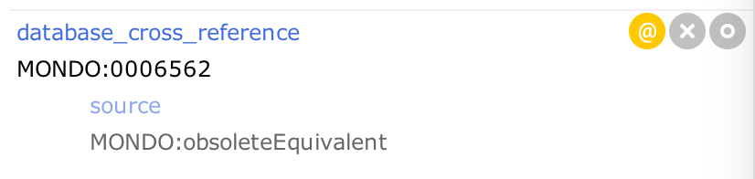

# GitHub Flow

See slides above and [GO workflow](http://go-ontology.readthedocs.io/en/latest/DailyWorkflow.html). 
Guidelines that are specific to editing Mondo are available here (see [1] Pull Request Workflow).
**ALL CHANGES ARE DONE AS PULL REQUESTS**
TODO: Document

* What to do in the case of a conflict e.g [https://github.com/AgileVentures/MetPlus_PETS/wiki/Developing-a-feature-(or-bug,-chore)](https://github.com/AgileVentures/MetPlus_PETS/wiki/Developing-a-feature-(or-bug,-chore)) 
* Checking your diffs

## Github Workflow

No changes are to be committed to master. **Make all changes on branches, and make Pull Requests**. See: 

* [http://go-ontology.readthedocs.io/en/latest/DailyWorkflow.html](http://go-ontology.readthedocs.io/en/latest/DailyWorkflow.html)

## Merging and Obsoleting Classes

There are 3 ways to merge classes:

* Manually (not recommended)
* Using the Protege merge tool (not yet released)
* Using owltools

Until the Protege merge tool is ready it is preferred to make merge requests via Chris. This should be done in plain text, either csv or tsv. Two columns (or optionally 4 columns with labels):

1. CURIE of class to be obsoleted
1. CURIE of replacement class

These are then merged like this:

```
owltools mondo-edit.obo  --obsolete-replace MONDO:0000267 MONDO:0015264 --assert-inferred-subclass-axioms --markIsInferred --removeRedundant -o -f obo new.obo
diff mondo-edit.obo new.obo
mv new.obo mondo-edit.obo
```

Note this can frequently lead to cycles and equivalence between named class pairs, as many seemingly identical classes have different implicit semantics.

## Manual merge/obsolete

by Nicole Vasilevsky 08/31/18

1. If one class should be merged with another class, first obsolete the class that will be merged.
1. Search for the class to be obsoleted
1. Rename label to: obsolete [class name]
1. Add annotation **owl:deprecated** and indicated true (in literal)
1. Add annotation **term replaced by** and add ID of term which replaced it (in CURIE format, such as MONDO:0010684).
1. Remove superclass axioms
1. If the class has children, remove the superclass assertion for the children 
1. Example: 
1. Search for the replacement term
1. Add annotation **database_cross_reference** and add the term ID
Annotate the database_cross_reference annotation with **source** MONDO:obsoleteEquivalent (in the literal tab)
1. Example: 
1. Move all the synonyms to the new term. 
1. If applicable, to mark the synonym as deprecated, add an annotation to the synonym: has_synonym_type ‘A synonym that is historic and discouraged’. See granulomatosis with polyangiitis for examples of deprecated syn axiom annotations

Note: A Mondo obsolete class should not have an xref axiom tagged with "MONDO:equivalentTo". Instead use "MONDO:obsoleteEquivalent" to map between an obsolete MONDO class and a live entry in another resource (these serve as a kind of flag of a state of inconsistency).

## Excluded subclassOf

Rather than removing a subClassOf that comes from a trusted source (like ordo), we usually turn it into an excluded_subClassOf annotation.
For an example, see MONDO_0020528 'ACTH-dependent Cushing syndrome'


## When to obsolete / merge

TODO: document process for informing developers/users
