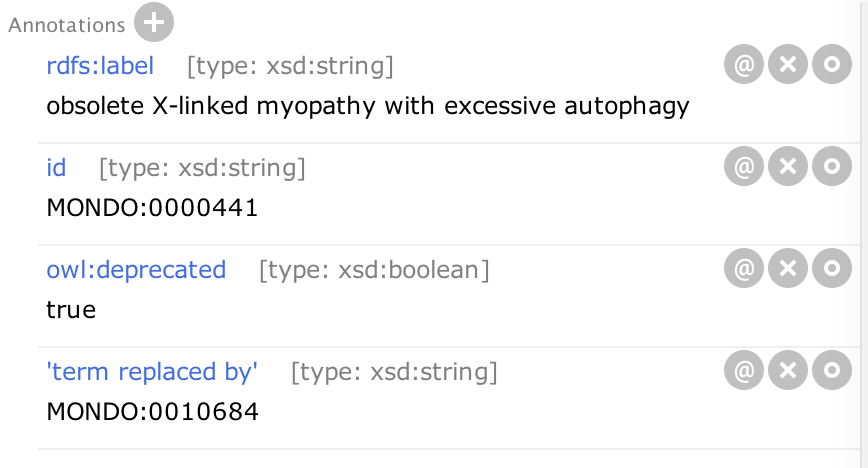

## Merging and Obsoleting Classes

### Overview

## When to obsolete / merge

If a term is a candidate for obsoletion and/or merging, this should be reported on the [GitHub issue tracker](https://github.com/monarch-initiative/mondo/issues) and labeled 'obsolete'. Click [here](https://github.com/monarch-initiative/mondo/issues?q=is%3Aissue+is%3Aopen+label%3Aobsolete) for potential terms to be obsoleted.

Some examples of when to obsolete and/or merge a term are:  

- **Duplicate terms** (for example MONDO:0019055 mitochondrial disease was obsoleted and replaced by MONDO:0004069 'inborn mitochondrial metabolism disorder')  
- **Out of scope**- Terms that are not truly diseases, (ie phenotype terms, such as MONDO:0007348 Colchicine resistance). For another example, see [see #503](https://github.com/monarch-initiative/mondo/issues/503)  
- **obsoleted in source**: for example, OMIM, Orphanet or GARD may retire or obsolete a term. For example, MONDO:0015173 obsolete autoimmune enteropathy type 2
is a phenotype and not a disease: for example, MONDO:0043606 'obsolete pathologic fracture'

Issues should remain open for at least two months to allow for the community to comment and bring up any objections. All obsoletions will be done via a pull request and reviewed by Mondo developers.

See [GitHub Discussion](https://github.com/monarch-initiative/mondo/discussions/2765) on Obsoletions

## Workflow
1. Mondo users need to be notified before we obsolete, merge or [split](https://mondo.readthedocs.io/en/latest/editors-guide/splitting-classes/) a Mondo class.
1. If there is a request to obsolete a Mondo class, [Monarch Initiative](https://monarchinitiative.org/) to determine if the disease term is used for Monarch annotations. For example, [discitis](https://monarchinitiative.org/disease/MONDO:0006728) (see ticket [here](https://github.com/monarch-initiative/mondo/issues/501)) does not have any annotations in Monarch. (_This is something that we hope to automate in the future_).
3. If a term is to be obsoleted, in a new row in the [ROBOT_ObsoleteTag spreadsheet template](https://docs.google.com/spreadsheets/d/1tt1Wk70j9XiHLV1vKQyNiHhaazh286pobpJk1ecSCCg/edit#gid=505727337), add the following information for the term-to-be-obsoleted:
    1. ID for term to be obsoleted 
    1. Label for term to be obsoleted 
    1. 'term tracker item': GitHub ticket that describes the obsoletion request
    1. Consider: the replacement term that should be considered for use after the term is obsoleted. If there is no replacement, leave it blank.
    1. Obsoletion reason: chose from dropdown list.
    1. Comment: 
       1. Do not add free text here. Copy and paste the formula from the row above so the comment is consistently structured.
       1. Manually check the term to be obsoleted for comment. 
          1. If the term to be obsoleted already has a comment, manually add the structured obsoletion comment to the existing comment.
          2. If the term to be obsoleted does NOT has a comment, copy and paste the formula from the row above and add it in the "Comment to be automatically added" column  
    1. Obsoletion candidate subset: This should always be http://purl.obolibrary.org/obo/mondo#obsoletion_candidate
    1. obsoletion date: should be a release date at the first of the month, at least two months from today. Please write in the format YYYY-MM-DD.
4. If a term is to be merged, in a new row in the [ROBOT_MergeTag spreadsheet template](https://docs.google.com/spreadsheets/d/1tt1Wk70j9XiHLV1vKQyNiHhaazh286pobpJk1ecSCCg/edit#gid=1109324509), add the information above, and in addition, add:
    1. Mondo ID for the term that will replace the obsoleted terms
    1. Label for the term that will replace the obsoleted terms

#### Monthly (before release)
1. Run the pipeline to [merge the ROBOT template](https://mondo.readthedocs.io/en/latest/editors-guide/robot-template/) and commit and merge the PR into mondo-edit.obo.
3. Run the [risky_obsoletion_check](https://mondo.readthedocs.io/en/latest/editors-guide/risky_obsoletion_check) pipeline to check if external ontologies and databases (such as EFO and ClinGen) are using this Mondo term.
  - if so, create a ticket on the [EFO tracker](https://github.com/EBISPOT/efo/issues) and notify ClinGen users (_for now, email Larry Babb_).
1. Perform a SPARQL query to identify all the obsoletion candidates (see instructions [here](https://mondo.readthedocs.io/en/latest/editors-guide/generate-report/#how-to-generate-reports)). The command to run the query is: `sh run.sh make report-query-obsoletioncandidates-withcomment`. This will be the report that will be shared with Mondo users to inform them of upcoming obsoletions.
1. Share the report on the Mondo users email list (include the file as an attachment) and/or share the report (tsv file) on GitHub [here](https://github.com/monarch-initiative/mondo/tree/master/reports/obsoletion-candidates).
1. Allow for at least one month after sending the report or contacting users before obsoleting the terms to allow users time to comment.

### How to
There are 2 ways to merge classes:

* Manually (not recommended)
* Using owltools

To use owl tools  will need to have Docker installed and running (see instructions [here](https://mondo.readthedocs.io/en/latest/editors-guide/set-up-new-computer/#set-up-docker)). This should be done in plain text, either csv or tsv. Two columns (or optionally 4 columns with labels):

1. CURIE of class to be obsoleted
1. CURIE of replacement class

These are then merged like this:

```
owltools mondo-edit.obo  --obsolete-replace MONDO:0000267 MONDO:0015264 --assert-inferred-subclass-axioms --markIsInferred --removeRedundant -o -f obo new.obo
diff mondo-edit.obo new.obo
mv new.obo mondo-edit.obo
```

Note this can frequently lead to cycles and equivalence between named class pairs, as many seemingly identical classes have different implicit semantics.

Note: if you add an obsoletion reason, make sure that the replaced class does not have an alt_id assertion. If so, remove that before committing.

## Merge terms

### Merge using owltools

1. Create a branch and name it issue-### (for example issue-2864)
1. Open Protege
1. Prepare the owltools command:
`owltools --use-catalog mondo-edit.obo  --obsolete-replace [CURIE 1] [CURIE 2] -o -f obo mondo-edit.obo`  

CURIE 1 = term to be obsoleted  
CURIE 2 = replacement term (ie term to be merged with)

For example:
If to merge MONDO:0023052 ectrodactyly polydactyly with MONDO:0009156 ectrodactyly-polydactyly syndrome, the command is: 

`owltools --use-catalog mondo-edit.obo  --obsolete-replace MONDO:0023052 MONDO:0009156 -o -f obo mondo-edit.obo`

_Recommended_: Use this [template](https://docs.google.com/spreadsheets/d/1tt1Wk70j9XiHLV1vKQyNiHhaazh286pobpJk1ecSCCg/edit#gid=1265889881) to track the terms to be mergd. There is a formula in column G, copy from the row above.
_Note_: the Mondo ID in columns A and C must be in CURIE format (use a colon, not an underscore)  

1. In Terminal, navigate to ..mondo/src/ontology
1. Run your owltools command
1. **Review diff**: Check the output in GitHub Desktop. _Note: you may see an unexpected addition at the top that starts with owl-axioms... This is because two IDs were added to replacement term. The instructions below note to remove the additional ID, and this will go away after you do that._
1. The owltools command will move all of the dbxrefs to the new term. We can have proxy merges, ie two MONDO:equivalentTo xrefs from the same source. If this is the case, one dbxref should be marked as MONDO:preferredExternal (as a source annotation on the dbxref) in addition to the MONDO:equivalentTo source annotation. 


1. Open a new version of mondo-edit.obo in Protege
1. **Obsoleted class**: Search for the term that was obsoleted
1. Add 'term tracker item' (type xsd:anyURI) annotation with a link to the GitHub issue that requested the obsoletion.
1. Add an obsoletion reason: use the annotation property 'has obsolescence reason' and write 'terms merged' in the literal field.
1. Any source annotations to MONDO:equivalentTo on a dbxref should be changed to MONDO:obsoleteEquivalent.
1. _Optional:_ Add an additional comment (rdfs:comment) explaning why the terms were merged.
1. **Replacement term**: Search for the 'term replaced by' term
1. Delete the old ID (_if you check the diff after doing this and saving, you'll see the unexpected addition will disappear_)
1. Review the annotations to ensure there are no duplicate annotations. If there are, they should be combined. (Sometimes this is easier to review in the diff in GitHub Desktop, but they must be fixed in Protege.)
1. Review the subClassOf assertions, and make sure there are no duplicates. If there are, they should be combined.
1. Remove the annotations: 'in subset obsoletion candidate' and 'scheduled for obsoletion on or after'  
1. When reviewing the diff, make sure there is not an Alt ID. The diff should only show additions to the merged term and the obsoletion

<iframe width="560" height="315" src="https://www.youtube.com/embed/hhuq4Lwz0Ds" title="YouTube video player" frameborder="0" allow="accelerometer; autoplay; clipboard-write; encrypted-media; gyroscope; picture-in-picture" allowfullscreen></iframe>

<iframe width="560" height="315" src="https://www.youtube.com/embed/EjM_xigLisg" title="YouTube video player" frameborder="0" allow="accelerometer; autoplay; clipboard-write; encrypted-media; gyroscope; picture-in-picture" allowfullscreen></iframe>

### Manual merge/obsolete
1. If one class should be merged with another class, first obsolete the class that will be merged.
1. Search for the class to be obsoleted
1. Rename label to: obsolete [class name]
1. Add annotation **owl:deprecated** and indicate true (in literal)
1. Add annotation **term replaced by** and add ID of term which replaced it (in CURIE format, such as MONDO:0010684). If the disease term is being obsoleted and an HPO term should be used instead, do not use **term replaced by**, rather use the annotation **consider.** For example, see MONDO:0001445.
1. Add an obsoletion reason: use the annotation property 'has obsolescence reason' and manually write in a reason as a string (usually 'out of scope'). Add a source annotation to the obolescence reason that comes from this [list of exclusion reasons](https://mondo.readthedocs.io/en/latest/editors-guide/exclusion-reasons/).
1. _Optional:_ Add an additional comment (rdfs:comment) explaning why the terms were merged.
1. Add annotation 'term tracker item' (type xsd:anyURI)with a link to the GitHub issue that requested the obsoletion.
1. Remove superclass axioms
1. If the class has children, remove the superclass assertion for the children 
1. Example: 
1. Move all the synonyms to the new term. 
1. Retain all of the **database_cross_references** on the obsoleted term. Any annotations to MONDO:equivalentTo should be changed to MONDO:obsoleteEquivalent.
1. If applicable, to mark the synonym as deprecated, add an annotation to the synonym: has_synonym_type ‘A synonym that is historic and discouraged’. See granulomatosis with polyangiitis for examples of deprecated syn axiom annotations.

Note: An obsolete Mondo class should not have an xref axiom tagged with "MONDO:equivalentTo". Instead use "MONDO:obsoleteEquivalent" to map between an obsolete MONDO class and a live entry in another resource (these serve as a kind of flag of a state of inconsistency).

## Obsolete a class (without merging)

### Obsolete a class (using Protege 'Make entity obsolete' function)
1. Search for the class to be obsoleted.
1. In the Protege edit menu-> Make entity obsolete
1. Prepend the definition with OBSOLETE. For example, OBSOLETE. Chronic form of myeloproliferative neoplasm. 
1. Add an obsoletion reason: use the annotation property 'has obsolescence reason' and manually write in a reason as a string (usually 'out of scope'). Add a source annotation to the obolescence reason that comes from this [list of exclusion reasons](https://mondo.readthedocs.io/en/latest/editors-guide/exclusion-reasons/).
1. Add annotation 'term tracker item' (type xsd:anyURI)with a link to the GitHub issue that requested the obsoletion.
1. If the term has **database_cross_reference annotations** and the **source** is annotated as MONDO:equivalentTo, change the source to **source** MONDO:obsoleteEquivalent (in the literal tab). Obsolete terms should never be equivalent.
1. Add annotation consider, add the CURIE for the term that should be considered as a replacement.
1. _Optional:_ Add an additional comment (rdfs:comment) explaning why the term was obsoleted.

### Obsolete a class (manually)
1. Search for the class to be obsoleted.
1. Rename label to: obsolete [class name].
1. Add annotation **owl:deprecated** and indicate true (in literal).
1. Prepend the definition with OBSOLETE. For example, OBSOLETE. Chronic form of myeloproliferative neoplasm. 
1. Add an obsoletion reason: use the annotation property 'has obsolescence reason' and manually write in a reason as a string (usually 'out of scope'). Add a source annotation to the obolescence reason that comes from this [list of exclusion reasons](https://mondo.readthedocs.io/en/latest/editors-guide/exclusion-reasons/).
1. Add annotation 'term tracker item' (type xsd:anyURI) with a link to the GitHub issue that requested the obsoletion.
1. Remove superclass axioms.
1. If the class has children, remove the superclass assertions for the children.
1. If the term has **database_cross_reference annotations** and the **source** is annotated as MONDO:equivalentTo, change the source to **source** MONDO:obsoleteEquivalent (in the literal tab). Obsolete terms should never be equivalent.
1. _Optional:_ Add an additional comment (rdfs:comment) explaning why the term was obsoleted.

## Simple mass obsoletion pipeline

If you only want to obsolete terms without taking another look, you can use the simple mass obsoletion pipeline:

1. add all terms you wish to obsolete to config/obsolete_me.txt
1. run `sh run.sh make mass_obsolete2 -B`
1. Very carefully review the diff. More carefully then usual!

## Restoring an Obsolete Ontology Term

### When to restore or reinstate an ontology term

There may be rare cases when we chose to reinstate or restore an obsolete class. For example, in this ticket ([#4948](https://github.com/monarch-initiative/mondo/issues/4948)) we decided to reinstate some Orphanet grouping classes because they were used in the classification scheme described by the authors of the [paper](https://pubmed.ncbi.nlm.nih.gov/31633310/).

**Note**: The Gene Ontology has [instructions to restore an obsolete term](https://wiki.geneontology.org/index.php/Restoring_an_Obsolete_Ontology_Term), but in Mondo, we prefer to create a new term and mint a new ID, and point from the obsoleted term to the new term using the `replaced_by` annotation.

### Restore an obsolete term (Add new term)

1. Follow the usual instructions to [create a new term](https://mondo.readthedocs.io/en/latest/editors-guide/add-new-terms/#add-a-new-term) in Mondo. 
  1. _More advanced_: New terms can be added using the text file:
    1. Open mondo-edit.obo in a text editor, like Atom.
    1. Find the obsoleted term.
    1. Copy the stanzas for that term and paste as a new term in the file.
    1. Replace the ID with the new ID
    1. Remove the 'obsolete' from the label
    1. Remove the obsolescence annotations: 
       1. property_value: IAO:0000231 "out of scope" xsd:string
       1. is_obsolete: true
    1. If applicable, change the source annotations from MONDO:obsoleteEquivalent to MONDO:equivalentTo
    1. Update the 'term tracker item' (type xsd:anyURI)annotation to point to the relevant ticket
1. Find the obsolete term, and add (or replace) the annotation 'replaced_by' to point to the new ID.
  1. **Note**: A term cannot have both a `consider` annotation and a `replaced_by` annotation. Add only the `replaced_by` annotation that points to the new term you created.
1. If edits were made in the text file, be sure to open the file in Protege and Save As -> mondo-edit.obo and replace existing failure
1. Commit to your branch and create a pull request

by Nicole Vasilevsky and Sabrina Toro _updated 2022-06-07_
