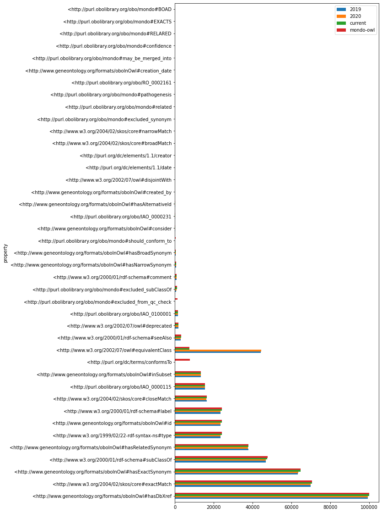

    <IPython.core.display.Javascript object>

# Mondo analysis

from ontobio.ontol_factory import OntologyFactory
mondo_file="/Users/matentzn/ws/mondo/src/ontology/mondo-qc.obo"
ofa = OntologyFactory()
ont = ofa.create(mondo_file)
ont.get_roots()[:3]

mondo="http://purl.obolibrary.org/obo/mondo.owl"
g = Graph()
g.parse("../mondo-qc.owl", format="xml")

## Robot report analysis

## Overview of errors

This breaks down the errors in the generic ROBOT report. _Note that the whole report is filtered to only show results pertaining to MONDO classes themselves_. All tables are cut off at {{ NUMBER_ERRORS_SHOWN }} rows.

Table: Breakdown of the number of relationships in Mondo.

<table border="1" class="dataframe">
  <thead>
    <tr style="text-align: right;">
      <th>Rule Name</th>
    </tr>
  </thead>
  <tbody>
  </tbody>
</table>

## Detailed breakdown of errors: Editors file

## Other Quality Control checks

    WARNING!  mondo-qc-2017-no-subclass-between-genetic-disease-warning.tsv  is empty and has been skipped.
    WARNING!  mondo-qc-2018-no-subclass-between-genetic-disease-warning.tsv  is empty and has been skipped.
    WARNING!  mondo-qc-2017-omim-subsumption-warning.tsv  is empty and has been skipped.
    WARNING!  mondo-qc-2017-reflexive-warning.tsv  is empty and has been skipped.
    WARNING!  mondo-qc-2018-reflexive-warning.tsv  is empty and has been skipped.
    WARNING!  mondo-qc-current-reflexive-warning.tsv  is empty and has been skipped.
    WARNING!  mondo-qc-edit-reflexive-warning.tsv  is empty and has been skipped.
    WARNING!  mondo-qc-mondo-owl-reflexive-warning.tsv  is empty and has been skipped.
    WARNING!  mondo-qc-2017-single-child-warning.tsv  is empty and has been skipped.
    WARNING!  mondo-qc-2017-two-pattern-warning.tsv  is empty and has been skipped.
    WARNING!  mondo-qc-2018-two-pattern-warning.tsv  is empty and has been skipped.
    WARNING!  mondo-qc-2019-two-pattern-warning.tsv  is empty and has been skipped.
    WARNING!  mondo-qc-2020-two-pattern-warning.tsv  is empty and has been skipped.
    WARNING!  mondo-qc-current-two-pattern-warning.tsv  is empty and has been skipped.

<table border="1" class="dataframe">
  <thead>
    <tr style="text-align: right;">
      <th>check</th>
      <th>2017</th>
      <th>2018</th>
      <th>2019</th>
      <th>2020</th>
      <th>current</th>
      <th>edit</th>
      <th>mondo-owl</th>
    </tr>
  </thead>
  <tbody>
    <tr>
      <td>no-subclass-between-genetic-disease-warning</td>
      <td>NaN</td>
      <td>NaN</td>
      <td>214.0</td>
      <td>71.0</td>
      <td>74.0</td>
      <td>17.0</td>
      <td>74.0</td>
    </tr>
    <tr>
      <td>omim-subsumption-warning</td>
      <td>NaN</td>
      <td>814.0</td>
      <td>690.0</td>
      <td>556.0</td>
      <td>581.0</td>
      <td>517.0</td>
      <td>548.0</td>
    </tr>
    <tr>
      <td>reflexive-warning</td>
      <td>NaN</td>
      <td>NaN</td>
      <td>5.0</td>
      <td>5.0</td>
      <td>NaN</td>
      <td>NaN</td>
      <td>NaN</td>
    </tr>
    <tr>
      <td>related-exact-synonym-warning</td>
      <td>1.0</td>
      <td>200.0</td>
      <td>200.0</td>
      <td>200.0</td>
      <td>200.0</td>
      <td>200.0</td>
      <td>200.0</td>
    </tr>
    <tr>
      <td>single-child-warning</td>
      <td>NaN</td>
      <td>1280.0</td>
      <td>1637.0</td>
      <td>1580.0</td>
      <td>1558.0</td>
      <td>1381.0</td>
      <td>1556.0</td>
    </tr>
    <tr>
      <td>two-pattern-warning</td>
      <td>NaN</td>
      <td>NaN</td>
      <td>NaN</td>
      <td>NaN</td>
      <td>NaN</td>
      <td>4122.0</td>
      <td>4122.0</td>
    </tr>
  </tbody>
</table>

### Check: no-subclass-between-genetic-disease-warning

#### mondo-owl (Errors: 17)

<table border="1" class="dataframe">
  <thead>
    <tr style="text-align: right;">
      <th>term</th>
      <th>term_label</th>
      <th>d2</th>
      <th>d2_label</th>
      <th>ontology</th>
    </tr>
  </thead>
  <tbody>
    <tr>
      <td>MONDO:0044304</td>
      <td>hyperphenylalaninemia due to DNAJC12 deficiency</td>
      <td>MONDO:0009861</td>
      <td>phenylketonuria</td>
      <td>edit</td>
    </tr>
    <tr>
      <td>MONDO:0009711</td>
      <td>congenital fiber-type disproportion myopathy</td>
      <td>MONDO:0100084</td>
      <td>actinopathy</td>
      <td>edit</td>
    </tr>
    <tr>
      <td>MONDO:0012160</td>
      <td>spondylometaphyseal dysplasia-cone-rod dystrophy syndrome</td>
      <td>MONDO:0009943</td>
      <td>Pyle disease</td>
      <td>edit</td>
    </tr>
    <tr>
      <td>MONDO:0010486</td>
      <td>palmoplantar keratoderma, mutilating, with periorificial keratotic plaques, X-linked</td>
      <td>MONDO:0019014</td>
      <td>mutilating palmoplantar keratoderma with periorificial keratotic plaques</td>
      <td>edit</td>
    </tr>
    <tr>
      <td>MONDO:0009593</td>
      <td>spondylometaphyseal dysplasia, Sedaghatian type</td>
      <td>MONDO:0009943</td>
      <td>Pyle disease</td>
      <td>edit</td>
    </tr>
    <tr>
      <td>MONDO:0007982</td>
      <td>metaphyseal chondrodysplasia, Jansen type</td>
      <td>MONDO:0009943</td>
      <td>Pyle disease</td>
      <td>edit</td>
    </tr>
    <tr>
      <td>MONDO:0009652</td>
      <td>mucolipidosis type III gamma</td>
      <td>MONDO:0018931</td>
      <td>mucolipidosis type III</td>
      <td>edit</td>
    </tr>
    <tr>
      <td>MONDO:0009597</td>
      <td>metaphyseal chondrodysplasia, Spahr type</td>
      <td>MONDO:0009943</td>
      <td>Pyle disease</td>
      <td>edit</td>
    </tr>
    <tr>
      <td>MONDO:0008476</td>
      <td>spondyloepimetaphyseal dysplasia, Strudwick type</td>
      <td>MONDO:0009943</td>
      <td>Pyle disease</td>
      <td>edit</td>
    </tr>
    <tr>
      <td>MONDO:0011211</td>
      <td>axial spondylometaphyseal dysplasia</td>
      <td>MONDO:0009943</td>
      <td>Pyle disease</td>
      <td>edit</td>
    </tr>
    <tr>
      <td>MONDO:0008477</td>
      <td>spondylometaphyseal dysplasia, Kozlowski type</td>
      <td>MONDO:0009943</td>
      <td>Pyle disease</td>
      <td>edit</td>
    </tr>
    <tr>
      <td>MONDO:0009711</td>
      <td>congenital fiber-type disproportion myopathy</td>
      <td>MONDO:0100084</td>
      <td>actinopathy</td>
      <td>edit</td>
    </tr>
    <tr>
      <td>MONDO:0011939</td>
      <td>Spondyloenchondrodysplasia with immune dysregulation</td>
      <td>MONDO:0009943</td>
      <td>Pyle disease</td>
      <td>edit</td>
    </tr>
    <tr>
      <td>MONDO:0013223</td>
      <td>autosomal recessive spondylometaphyseal dysplasia, Megarbane type</td>
      <td>MONDO:0009943</td>
      <td>Pyle disease</td>
      <td>edit</td>
    </tr>
    <tr>
      <td>MONDO:0007983</td>
      <td>Schmid metaphyseal chondrodysplasia</td>
      <td>MONDO:0009943</td>
      <td>Pyle disease</td>
      <td>edit</td>
    </tr>
  </tbody>
</table>

### Check: omim-subsumption-warning

#### mondo-owl (Errors: 517)

<table border="1" class="dataframe">
  <thead>
    <tr style="text-align: right;">
      <th>term</th>
      <th>term_label</th>
      <th>p</th>
      <th>pn</th>
      <th>xc</th>
      <th>xp</th>
      <th>ontology</th>
    </tr>
  </thead>
  <tbody>
    <tr>
      <td>MONDO:0012758</td>
      <td>prostate cancer, hereditary, 13</td>
      <td>MONDO:0023122</td>
      <td>familial prostate carcinoma</td>
      <td>NaN</td>
      <td>NaN</td>
      <td>edit</td>
    </tr>
    <tr>
      <td>MONDO:0011286</td>
      <td>autosomal recessive nonsyndromic deafness 13</td>
      <td>MONDO:0019588</td>
      <td>autosomal recessive nonsyndromic deafness</td>
      <td>NaN</td>
      <td>NaN</td>
      <td>edit</td>
    </tr>
    <tr>
      <td>MONDO:0009967</td>
      <td>renal tubular acidosis 3</td>
      <td>MONDO:0009818</td>
      <td>autosomal recessive osteopetrosis 3</td>
      <td>NaN</td>
      <td>NaN</td>
      <td>edit</td>
    </tr>
    <tr>
      <td>MONDO:0032834</td>
      <td>retinitis pigmentosa 86</td>
      <td>MONDO:0019200</td>
      <td>retinitis pigmentosa</td>
      <td>NaN</td>
      <td>NaN</td>
      <td>edit</td>
    </tr>
    <tr>
      <td>MONDO:0012263</td>
      <td>AIS4</td>
      <td>MONDO:0007179</td>
      <td>autoimmune disease</td>
      <td>NaN</td>
      <td>NaN</td>
      <td>edit</td>
    </tr>
    <tr>
      <td>MONDO:0013610</td>
      <td>retinitis pigmentosa 61</td>
      <td>MONDO:0019200</td>
      <td>retinitis pigmentosa</td>
      <td>NaN</td>
      <td>NaN</td>
      <td>edit</td>
    </tr>
    <tr>
      <td>MONDO:0012395</td>
      <td>cataract 18</td>
      <td>MONDO:0011060</td>
      <td>early-onset non-syndromic cataract</td>
      <td>NaN</td>
      <td>NaN</td>
      <td>edit</td>
    </tr>
    <tr>
      <td>MONDO:0013611</td>
      <td>retinitis pigmentosa 62</td>
      <td>MONDO:0019200</td>
      <td>retinitis pigmentosa</td>
      <td>NaN</td>
      <td>NaN</td>
      <td>edit</td>
    </tr>
    <tr>
      <td>MONDO:0011774</td>
      <td>autosomal recessive nonsyndromic deafness 30</td>
      <td>MONDO:0019588</td>
      <td>autosomal recessive nonsyndromic deafness</td>
      <td>NaN</td>
      <td>NaN</td>
      <td>edit</td>
    </tr>
    <tr>
      <td>MONDO:0012903</td>
      <td>autosomal recessive nonsyndromic deafness 45</td>
      <td>MONDO:0019588</td>
      <td>autosomal recessive nonsyndromic deafness</td>
      <td>NaN</td>
      <td>NaN</td>
      <td>edit</td>
    </tr>
    <tr>
      <td>MONDO:0027462</td>
      <td>autosomal recessive cutis laxa type 2c</td>
      <td>MONDO:0009054</td>
      <td>autosomal recessive cutis laxa type 2, classic type</td>
      <td>NaN</td>
      <td>NaN</td>
      <td>edit</td>
    </tr>
    <tr>
      <td>MONDO:0044314</td>
      <td>retinitis pigmentosa 78</td>
      <td>MONDO:0019200</td>
      <td>retinitis pigmentosa</td>
      <td>NaN</td>
      <td>NaN</td>
      <td>edit</td>
    </tr>
    <tr>
      <td>MONDO:0010720</td>
      <td>partial androgen insensitivity syndrome</td>
      <td>MONDO:0019154</td>
      <td>androgen insensitivity syndrome</td>
      <td>NaN</td>
      <td>NaN</td>
      <td>edit</td>
    </tr>
    <tr>
      <td>MONDO:0012863</td>
      <td>attention deficit-hyperactivity disorder, susceptibility to, 6</td>
      <td>MONDO:0007743</td>
      <td>attention deficit-hyperactivity disorder</td>
      <td>NaN</td>
      <td>NaN</td>
      <td>edit</td>
    </tr>
    <tr>
      <td>MONDO:0013489</td>
      <td>autosomal recessive nonsyndromic deafness 89</td>
      <td>MONDO:0019588</td>
      <td>autosomal recessive nonsyndromic deafness</td>
      <td>NaN</td>
      <td>NaN</td>
      <td>edit</td>
    </tr>
  </tbody>
</table>

### Check: related-exact-synonym-warning

#### mondo-owl (Errors: 200)

<table border="1" class="dataframe">
  <thead>
    <tr style="text-align: right;">
      <th>term</th>
      <th>term_label</th>
      <th>related</th>
      <th>ontology</th>
    </tr>
  </thead>
  <tbody>
    <tr>
      <td>MONDO:0014756</td>
      <td>tremor, hereditary essential, 5</td>
      <td>ETM5</td>
      <td>edit</td>
    </tr>
    <tr>
      <td>MONDO:0006999</td>
      <td>tooth disease</td>
      <td>disorder of calcareous tooth</td>
      <td>edit</td>
    </tr>
    <tr>
      <td>MONDO:0009424</td>
      <td>Bartter disease type 2</td>
      <td>hyperprostaglandin E syndrome 2</td>
      <td>edit</td>
    </tr>
    <tr>
      <td>MONDO:0017686</td>
      <td>inborn aminoacylase deficiency</td>
      <td>rare inborn error of aminoacylase activity</td>
      <td>edit</td>
    </tr>
    <tr>
      <td>MONDO:0020680</td>
      <td>acute bronchiolitis</td>
      <td>acute bronchiolitis</td>
      <td>edit</td>
    </tr>
    <tr>
      <td>MONDO:0000651</td>
      <td>thoracic disease</td>
      <td>disorder of thoracic segment of trunk</td>
      <td>edit</td>
    </tr>
    <tr>
      <td>MONDO:0003832</td>
      <td>complement deficiency</td>
      <td>disorder of complement activation</td>
      <td>edit</td>
    </tr>
    <tr>
      <td>MONDO:0002031</td>
      <td>cecal disease</td>
      <td>disorder of caecum</td>
      <td>edit</td>
    </tr>
    <tr>
      <td>MONDO:0011018</td>
      <td>brachyolmia-amelogenesis imperfecta syndrome</td>
      <td>DASS</td>
      <td>edit</td>
    </tr>
    <tr>
      <td>MONDO:0011012</td>
      <td>African iron overload</td>
      <td>iron overload in Africa</td>
      <td>edit</td>
    </tr>
    <tr>
      <td>MONDO:0002081</td>
      <td>musculoskeletal system disease</td>
      <td>disorder of musculoskeletal system</td>
      <td>edit</td>
    </tr>
    <tr>
      <td>MONDO:0003225</td>
      <td>bone marrow disease</td>
      <td>disorder of bone marrow</td>
      <td>edit</td>
    </tr>
    <tr>
      <td>MONDO:0020240</td>
      <td>syndromic retinitis pigmentosa</td>
      <td>syndrome associated with retinitis pigmentosa</td>
      <td>edit</td>
    </tr>
    <tr>
      <td>MONDO:0016241</td>
      <td>alternating hemiplegia of childhood</td>
      <td>pediatric alternating hemiplegia</td>
      <td>edit</td>
    </tr>
    <tr>
      <td>MONDO:0011127</td>
      <td>Bartter disease type 1</td>
      <td>hyperprostaglandin E syndrome 1</td>
      <td>edit</td>
    </tr>
  </tbody>
</table>

### Check: single-child-warning

#### mondo-owl (Errors: 1381)

<table border="1" class="dataframe">
  <thead>
    <tr style="text-align: right;">
      <th>term</th>
      <th>total</th>
      <th>ontology</th>
    </tr>
  </thead>
  <tbody>
    <tr>
      <td>MONDO:0021202</td>
      <td>1</td>
      <td>edit</td>
    </tr>
    <tr>
      <td>MONDO:0007481</td>
      <td>1</td>
      <td>edit</td>
    </tr>
    <tr>
      <td>MONDO:0002326</td>
      <td>1</td>
      <td>edit</td>
    </tr>
    <tr>
      <td>MONDO:0021468</td>
      <td>1</td>
      <td>edit</td>
    </tr>
    <tr>
      <td>MONDO:0003960</td>
      <td>1</td>
      <td>edit</td>
    </tr>
    <tr>
      <td>MONDO:0011140</td>
      <td>1</td>
      <td>edit</td>
    </tr>
    <tr>
      <td>MONDO:0021203</td>
      <td>1</td>
      <td>edit</td>
    </tr>
    <tr>
      <td>MONDO:0021469</td>
      <td>1</td>
      <td>edit</td>
    </tr>
    <tr>
      <td>MONDO:0002894</td>
      <td>1</td>
      <td>edit</td>
    </tr>
    <tr>
      <td>MONDO:0006282</td>
      <td>1</td>
      <td>edit</td>
    </tr>
    <tr>
      <td>MONDO:0020264</td>
      <td>1</td>
      <td>edit</td>
    </tr>
    <tr>
      <td>MONDO:0044346</td>
      <td>1</td>
      <td>edit</td>
    </tr>
    <tr>
      <td>MONDO:0001697</td>
      <td>1</td>
      <td>edit</td>
    </tr>
    <tr>
      <td>MONDO:0003656</td>
      <td>1</td>
      <td>edit</td>
    </tr>
    <tr>
      <td>MONDO:0001564</td>
      <td>1</td>
      <td>edit</td>
    </tr>
  </tbody>
</table>

### Check: two-pattern-warning

#### mondo-owl (Errors: 4122)

<table border="1" class="dataframe">
  <thead>
    <tr style="text-align: right;">
      <th>c1</th>
      <th>n0</th>
      <th>n1</th>
      <th>ontology</th>
    </tr>
  </thead>
  <tbody>
    <tr>
      <td>MONDO:0020592</td>
      <td>&lt;http://purl.obolibrary.org/obo/mondo/patterns/location.yaml</td>
      <td>&lt;http://purl.obolibrary.org/obo/mondo/patterns/location_top.yaml</td>
      <td>edit</td>
    </tr>
    <tr>
      <td>MONDO:0017941</td>
      <td>&lt;http://purl.obolibrary.org/obo/mondo/patterns/environmental_stimulus.yaml</td>
      <td>&lt;http://purl.obolibrary.org/obo/mondo/patterns/specific_infectious_disease_by_agent.yaml</td>
      <td>edit</td>
    </tr>
    <tr>
      <td>MONDO:0017941</td>
      <td>&lt;http://purl.obolibrary.org/obo/mondo/patterns/environmental_stimulus.yaml</td>
      <td>&lt;http://purl.obolibrary.org/obo/mondo/patterns/infectious_disease_by_agent.yaml</td>
      <td>edit</td>
    </tr>
    <tr>
      <td>MONDO:0000965</td>
      <td>&lt;http://purl.obolibrary.org/obo/mondo/patterns/location.yaml</td>
      <td>&lt;http://purl.obolibrary.org/obo/mondo/patterns/lipoma.yaml</td>
      <td>edit</td>
    </tr>
    <tr>
      <td>MONDO:0005996</td>
      <td>&lt;http://purl.obolibrary.org/obo/mondo/patterns/environmental_stimulus.yaml</td>
      <td>&lt;http://purl.obolibrary.org/obo/mondo/patterns/specific_infectious_disease_by_agent.yaml</td>
      <td>edit</td>
    </tr>
    <tr>
      <td>MONDO:0005996</td>
      <td>&lt;http://purl.obolibrary.org/obo/mondo/patterns/environmental_stimulus.yaml</td>
      <td>&lt;http://purl.obolibrary.org/obo/mondo/patterns/infectious_disease_by_agent.yaml</td>
      <td>edit</td>
    </tr>
    <tr>
      <td>MONDO:0000290</td>
      <td>&lt;http://purl.obolibrary.org/obo/mondo/patterns/environmental_stimulus.yaml</td>
      <td>&lt;http://purl.obolibrary.org/obo/mondo/patterns/infectious_disease_by_agent.yaml</td>
      <td>edit</td>
    </tr>
    <tr>
      <td>MONDO:0000290</td>
      <td>&lt;http://purl.obolibrary.org/obo/mondo/patterns/environmental_stimulus.yaml</td>
      <td>&lt;http://purl.obolibrary.org/obo/mondo/patterns/specific_infectious_disease_by_agent.yaml</td>
      <td>edit</td>
    </tr>
    <tr>
      <td>MONDO:0005728</td>
      <td>&lt;http://purl.obolibrary.org/obo/mondo/patterns/location.yaml</td>
      <td>&lt;http://purl.obolibrary.org/obo/mondo/patterns/location_top.yaml</td>
      <td>edit</td>
    </tr>
    <tr>
      <td>MONDO:0003150</td>
      <td>&lt;http://purl.obolibrary.org/obo/mondo/patterns/location.yaml</td>
      <td>&lt;http://purl.obolibrary.org/obo/mondo/patterns/location_top.yaml</td>
      <td>edit</td>
    </tr>
    <tr>
      <td>MONDO:0004522</td>
      <td>&lt;http://purl.obolibrary.org/obo/mondo/patterns/specific_inflammatory_disease_by_site.yaml</td>
      <td>&lt;http://purl.obolibrary.org/obo/mondo/patterns/specific_infectious_disease_by_location.yaml</td>
      <td>edit</td>
    </tr>
    <tr>
      <td>MONDO:0004522</td>
      <td>&lt;http://purl.obolibrary.org/obo/mondo/patterns/specific_inflammatory_disease_by_site.yaml</td>
      <td>&lt;http://purl.obolibrary.org/obo/mondo/patterns/inflammatory_disease_by_site.yaml</td>
      <td>edit</td>
    </tr>
    <tr>
      <td>MONDO:0019239</td>
      <td>&lt;http://purl.obolibrary.org/obo/mondo/patterns/inborn_metabolic.yaml</td>
      <td>&lt;http://purl.obolibrary.org/obo/mondo/patterns/inborn_metabolic_disrupts.yaml</td>
      <td>edit</td>
    </tr>
    <tr>
      <td>MONDO:0002145</td>
      <td>&lt;http://purl.obolibrary.org/obo/mondo/patterns/basis_in_disruption_of_process.yaml</td>
      <td>&lt;http://purl.obolibrary.org/obo/mondo/patterns/disrupts_process.yaml</td>
      <td>edit</td>
    </tr>
    <tr>
      <td>MONDO:0001165</td>
      <td>&lt;http://purl.obolibrary.org/obo/mondo/patterns/location_top.yaml</td>
      <td>&lt;http://purl.obolibrary.org/obo/mondo/patterns/location.yaml</td>
      <td>edit</td>
    </tr>
  </tbody>
</table>

## Mondo Statistics

## Relationships

### Table: Breakdown of the number of relationships in Mondo.

<table border="1" class="dataframe">
  <thead>
    <tr style="text-align: right;">
      <th>property</th>
      <th>2017</th>
      <th>2018</th>
      <th>2019</th>
      <th>2020</th>
      <th>current</th>
      <th>mondo-owl</th>
      <th>edit</th>
    </tr>
  </thead>
  <tbody>
    <tr>
      <td>&lt;http://www.geneontology.org/formats/oboInOwl#hasDbXref</td>
      <td>187</td>
      <td>84157</td>
      <td>99234</td>
      <td>99326</td>
      <td>100034</td>
      <td>100068</td>
      <td>128546</td>
    </tr>
    <tr>
      <td>&lt;http://www.w3.org/2004/02/skos/core#exactMatch</td>
      <td>0</td>
      <td>0</td>
      <td>69877</td>
      <td>69979</td>
      <td>70604</td>
      <td>70633</td>
      <td>0</td>
    </tr>
    <tr>
      <td>&lt;http://www.geneontology.org/formats/oboInOwl#hasExactSynonym</td>
      <td>22</td>
      <td>42059</td>
      <td>63390</td>
      <td>63636</td>
      <td>64723</td>
      <td>64753</td>
      <td>64753</td>
    </tr>
    <tr>
      <td>&lt;http://www.w3.org/2000/01/rdf-schema#subClassOf</td>
      <td>106</td>
      <td>35535</td>
      <td>46835</td>
      <td>46891</td>
      <td>47630</td>
      <td>47693</td>
      <td>47106</td>
    </tr>
    <tr>
      <td>&lt;http://www.geneontology.org/formats/oboInOwl#hasRelatedSynonym</td>
      <td>2</td>
      <td>24730</td>
      <td>37814</td>
      <td>37757</td>
      <td>37785</td>
      <td>37778</td>
      <td>37778</td>
    </tr>
    <tr>
      <td>&lt;http://www.w3.org/1999/02/22-rdf-syntax-ns#type</td>
      <td>879</td>
      <td>20750</td>
      <td>23555</td>
      <td>23623</td>
      <td>24297</td>
      <td>24323</td>
      <td>24323</td>
    </tr>
    <tr>
      <td>&lt;http://www.geneontology.org/formats/oboInOwl#id</td>
      <td>0</td>
      <td>20750</td>
      <td>23443</td>
      <td>23510</td>
      <td>24180</td>
      <td>24206</td>
      <td>24206</td>
    </tr>
    <tr>
      <td>&lt;http://www.w3.org/2000/01/rdf-schema#label</td>
      <td>879</td>
      <td>20750</td>
      <td>23442</td>
      <td>23510</td>
      <td>24180</td>
      <td>24206</td>
      <td>24206</td>
    </tr>
    <tr>
      <td>&lt;http://www.w3.org/2004/02/skos/core#closeMatch</td>
      <td>0</td>
      <td>0</td>
      <td>16375</td>
      <td>16273</td>
      <td>16510</td>
      <td>16512</td>
      <td>0</td>
    </tr>
    <tr>
      <td>&lt;http://purl.obolibrary.org/obo/IAO_0000115</td>
      <td>6</td>
      <td>11711</td>
      <td>15425</td>
      <td>15452</td>
      <td>15504</td>
      <td>15504</td>
      <td>15504</td>
    </tr>
    <tr>
      <td>&lt;http://www.geneontology.org/formats/oboInOwl#inSubset</td>
      <td>8</td>
      <td>11183</td>
      <td>13335</td>
      <td>13383</td>
      <td>13454</td>
      <td>13458</td>
      <td>13458</td>
    </tr>
    <tr>
      <td>&lt;http://purl.org/dc/terms/conformsTo</td>
      <td>0</td>
      <td>0</td>
      <td>0</td>
      <td>0</td>
      <td>0</td>
      <td>7637</td>
      <td>7637</td>
    </tr>
    <tr>
      <td>&lt;http://www.w3.org/2002/07/owl#equivalentClass</td>
      <td>0</td>
      <td>31336</td>
      <td>44290</td>
      <td>44367</td>
      <td>7428</td>
      <td>7469</td>
      <td>7469</td>
    </tr>
    <tr>
      <td>&lt;http://www.w3.org/2000/01/rdf-schema#seeAlso</td>
      <td>0</td>
      <td>1843</td>
      <td>3062</td>
      <td>3063</td>
      <td>3162</td>
      <td>3173</td>
      <td>3173</td>
    </tr>
    <tr>
      <td>&lt;http://www.w3.org/2002/07/owl#deprecated</td>
      <td>790</td>
      <td>1021</td>
      <td>1756</td>
      <td>1794</td>
      <td>1965</td>
      <td>1975</td>
      <td>1975</td>
    </tr>
    <tr>
      <td>&lt;http://purl.obolibrary.org/obo/IAO_0100001</td>
      <td>717</td>
      <td>937</td>
      <td>1540</td>
      <td>1564</td>
      <td>1673</td>
      <td>1676</td>
      <td>1676</td>
    </tr>
    <tr>
      <td>&lt;http://purl.obolibrary.org/obo/mondo#excluded_from_qc_check</td>
      <td>0</td>
      <td>0</td>
      <td>0</td>
      <td>0</td>
      <td>0</td>
      <td>1397</td>
      <td>1397</td>
    </tr>
    <tr>
      <td>&lt;http://purl.obolibrary.org/obo/mondo#excluded_subClassOf</td>
      <td>0</td>
      <td>1</td>
      <td>789</td>
      <td>909</td>
      <td>1073</td>
      <td>1076</td>
      <td>1081</td>
    </tr>
    <tr>
      <td>&lt;http://www.w3.org/2000/01/rdf-schema#comment</td>
      <td>79</td>
      <td>329</td>
      <td>947</td>
      <td>952</td>
      <td>974</td>
      <td>978</td>
      <td>978</td>
    </tr>
    <tr>
      <td>&lt;http://www.geneontology.org/formats/oboInOwl#hasNarrowSynonym</td>
      <td>0</td>
      <td>293</td>
      <td>768</td>
      <td>774</td>
      <td>789</td>
      <td>791</td>
      <td>791</td>
    </tr>
    <tr>
      <td>&lt;http://www.geneontology.org/formats/oboInOwl#hasBroadSynonym</td>
      <td>0</td>
      <td>139</td>
      <td>443</td>
      <td>455</td>
      <td>490</td>
      <td>490</td>
      <td>490</td>
    </tr>
    <tr>
      <td>&lt;http://purl.obolibrary.org/obo/mondo#should_conform_to</td>
      <td>0</td>
      <td>0</td>
      <td>0</td>
      <td>0</td>
      <td>0</td>
      <td>486</td>
      <td>486</td>
    </tr>
    <tr>
      <td>&lt;http://www.geneontology.org/formats/oboInOwl#consider</td>
      <td>1</td>
      <td>8</td>
      <td>248</td>
      <td>251</td>
      <td>291</td>
      <td>294</td>
      <td>294</td>
    </tr>
    <tr>
      <td>&lt;http://purl.obolibrary.org/obo/IAO_0000231</td>
      <td>0</td>
      <td>0</td>
      <td>112</td>
      <td>118</td>
      <td>122</td>
      <td>122</td>
      <td>122</td>
    </tr>
    <tr>
      <td>&lt;http://www.geneontology.org/formats/oboInOwl#hasAlternativeId</td>
      <td>33</td>
      <td>47</td>
      <td>113</td>
      <td>113</td>
      <td>117</td>
      <td>117</td>
      <td>117</td>
    </tr>
    <tr>
      <td>&lt;http://www.geneontology.org/formats/oboInOwl#created_by</td>
      <td>0</td>
      <td>1</td>
      <td>4</td>
      <td>20</td>
      <td>89</td>
      <td>93</td>
      <td>93</td>
    </tr>
    <tr>
      <td>&lt;http://www.w3.org/2002/07/owl#disjointWith</td>
      <td>0</td>
      <td>14</td>
      <td>72</td>
      <td>71</td>
      <td>76</td>
      <td>76</td>
      <td>76</td>
    </tr>
    <tr>
      <td>&lt;http://purl.org/dc/elements/1.1/date</td>
      <td>0</td>
      <td>0</td>
      <td>55</td>
      <td>55</td>
      <td>55</td>
      <td>55</td>
      <td>55</td>
    </tr>
    <tr>
      <td>&lt;http://purl.org/dc/elements/1.1/creator</td>
      <td>0</td>
      <td>0</td>
      <td>54</td>
      <td>54</td>
      <td>54</td>
      <td>54</td>
      <td>54</td>
    </tr>
    <tr>
      <td>&lt;http://www.w3.org/2004/02/skos/core#broadMatch</td>
      <td>0</td>
      <td>0</td>
      <td>15</td>
      <td>15</td>
      <td>12</td>
      <td>12</td>
      <td>0</td>
    </tr>
    <tr>
      <td>&lt;http://www.w3.org/2004/02/skos/core#narrowMatch</td>
      <td>0</td>
      <td>0</td>
      <td>11</td>
      <td>12</td>
      <td>11</td>
      <td>11</td>
      <td>0</td>
    </tr>
    <tr>
      <td>&lt;http://purl.obolibrary.org/obo/mondo#excluded_synonym</td>
      <td>0</td>
      <td>0</td>
      <td>7</td>
      <td>7</td>
      <td>8</td>
      <td>8</td>
      <td>8</td>
    </tr>
    <tr>
      <td>&lt;http://purl.obolibrary.org/obo/mondo#related</td>
      <td>0</td>
      <td>0</td>
      <td>1</td>
      <td>1</td>
      <td>1</td>
      <td>1</td>
      <td>1</td>
    </tr>
    <tr>
      <td>&lt;http://purl.obolibrary.org/obo/mondo#pathogenesis</td>
      <td>0</td>
      <td>1</td>
      <td>1</td>
      <td>1</td>
      <td>1</td>
      <td>1</td>
      <td>1</td>
    </tr>
    <tr>
      <td>&lt;http://purl.obolibrary.org/obo/RO_0002161</td>
      <td>0</td>
      <td>1</td>
      <td>1</td>
      <td>1</td>
      <td>1</td>
      <td>1</td>
      <td>1</td>
    </tr>
    <tr>
      <td>&lt;http://www.geneontology.org/formats/oboInOwl#creation_date</td>
      <td>0</td>
      <td>1</td>
      <td>1</td>
      <td>1</td>
      <td>1</td>
      <td>1</td>
      <td>1</td>
    </tr>
    <tr>
      <td>&lt;http://purl.obolibrary.org/obo/mondo#may_be_merged_into</td>
      <td>0</td>
      <td>0</td>
      <td>1</td>
      <td>1</td>
      <td>0</td>
      <td>0</td>
      <td>0</td>
    </tr>
    <tr>
      <td>&lt;http://purl.obolibrary.org/obo/mondo#confidence</td>
      <td>0</td>
      <td>0</td>
      <td>0</td>
      <td>0</td>
      <td>0</td>
      <td>0</td>
      <td>5570</td>
    </tr>
    <tr>
      <td>&lt;http://purl.obolibrary.org/obo/mondo#RELARED</td>
      <td>0</td>
      <td>1</td>
      <td>0</td>
      <td>0</td>
      <td>0</td>
      <td>0</td>
      <td>0</td>
    </tr>
    <tr>
      <td>&lt;http://purl.obolibrary.org/obo/mondo#EXACTS</td>
      <td>0</td>
      <td>0</td>
      <td>1</td>
      <td>0</td>
      <td>0</td>
      <td>0</td>
      <td>0</td>
    </tr>
    <tr>
      <td>&lt;http://purl.obolibrary.org/obo/mondo#BOAD</td>
      <td>0</td>
      <td>0</td>
      <td>1</td>
      <td>0</td>
      <td>0</td>
      <td>0</td>
      <td>0</td>
    </tr>
  </tbody>
</table>

    <AxesSubplot:ylabel='property'>

    

    

### Table: Current release vs Edit release: Differences in the number of specific relations

<table border="1" class="dataframe">
  <thead>
    <tr style="text-align: right;">
      <th>property</th>
      <th>mondo-owl</th>
      <th>current</th>
      <th>difference</th>
    </tr>
  </thead>
  <tbody>
    <tr>
      <td>&lt;http://purl.org/dc/terms/conformsTo</td>
      <td>7637</td>
      <td>0</td>
      <td>7637</td>
    </tr>
    <tr>
      <td>&lt;http://purl.obolibrary.org/obo/mondo#excluded_from_qc_check</td>
      <td>1397</td>
      <td>0</td>
      <td>1397</td>
    </tr>
    <tr>
      <td>&lt;http://purl.obolibrary.org/obo/mondo#should_conform_to</td>
      <td>486</td>
      <td>0</td>
      <td>486</td>
    </tr>
    <tr>
      <td>&lt;http://www.w3.org/2000/01/rdf-schema#subClassOf</td>
      <td>47693</td>
      <td>47630</td>
      <td>63</td>
    </tr>
    <tr>
      <td>&lt;http://www.w3.org/2002/07/owl#equivalentClass</td>
      <td>7469</td>
      <td>7428</td>
      <td>41</td>
    </tr>
    <tr>
      <td>&lt;http://www.geneontology.org/formats/oboInOwl#hasDbXref</td>
      <td>100068</td>
      <td>100034</td>
      <td>34</td>
    </tr>
    <tr>
      <td>&lt;http://www.geneontology.org/formats/oboInOwl#hasExactSynonym</td>
      <td>64753</td>
      <td>64723</td>
      <td>30</td>
    </tr>
    <tr>
      <td>&lt;http://www.w3.org/2004/02/skos/core#exactMatch</td>
      <td>70633</td>
      <td>70604</td>
      <td>29</td>
    </tr>
    <tr>
      <td>&lt;http://www.geneontology.org/formats/oboInOwl#id</td>
      <td>24206</td>
      <td>24180</td>
      <td>26</td>
    </tr>
    <tr>
      <td>&lt;http://www.w3.org/2000/01/rdf-schema#label</td>
      <td>24206</td>
      <td>24180</td>
      <td>26</td>
    </tr>
    <tr>
      <td>&lt;http://www.w3.org/1999/02/22-rdf-syntax-ns#type</td>
      <td>24323</td>
      <td>24297</td>
      <td>26</td>
    </tr>
    <tr>
      <td>&lt;http://www.w3.org/2000/01/rdf-schema#seeAlso</td>
      <td>3173</td>
      <td>3162</td>
      <td>11</td>
    </tr>
    <tr>
      <td>&lt;http://www.w3.org/2002/07/owl#deprecated</td>
      <td>1975</td>
      <td>1965</td>
      <td>10</td>
    </tr>
    <tr>
      <td>&lt;http://www.geneontology.org/formats/oboInOwl#inSubset</td>
      <td>13458</td>
      <td>13454</td>
      <td>4</td>
    </tr>
    <tr>
      <td>&lt;http://www.w3.org/2000/01/rdf-schema#comment</td>
      <td>978</td>
      <td>974</td>
      <td>4</td>
    </tr>
    <tr>
      <td>&lt;http://www.geneontology.org/formats/oboInOwl#created_by</td>
      <td>93</td>
      <td>89</td>
      <td>4</td>
    </tr>
    <tr>
      <td>&lt;http://purl.obolibrary.org/obo/IAO_0100001</td>
      <td>1676</td>
      <td>1673</td>
      <td>3</td>
    </tr>
    <tr>
      <td>&lt;http://purl.obolibrary.org/obo/mondo#excluded_subClassOf</td>
      <td>1076</td>
      <td>1073</td>
      <td>3</td>
    </tr>
    <tr>
      <td>&lt;http://www.geneontology.org/formats/oboInOwl#consider</td>
      <td>294</td>
      <td>291</td>
      <td>3</td>
    </tr>
    <tr>
      <td>&lt;http://www.w3.org/2004/02/skos/core#closeMatch</td>
      <td>16512</td>
      <td>16510</td>
      <td>2</td>
    </tr>
    <tr>
      <td>&lt;http://www.geneontology.org/formats/oboInOwl#hasNarrowSynonym</td>
      <td>791</td>
      <td>789</td>
      <td>2</td>
    </tr>
    <tr>
      <td>&lt;http://www.geneontology.org/formats/oboInOwl#hasRelatedSynonym</td>
      <td>37778</td>
      <td>37785</td>
      <td>-7</td>
    </tr>
  </tbody>
</table>

How many x have changes since the last release: 

- Source overlap (how many terms from each source are covered?)
- Measure changes between subclasses based on OMIM vs MOndo (etc)

